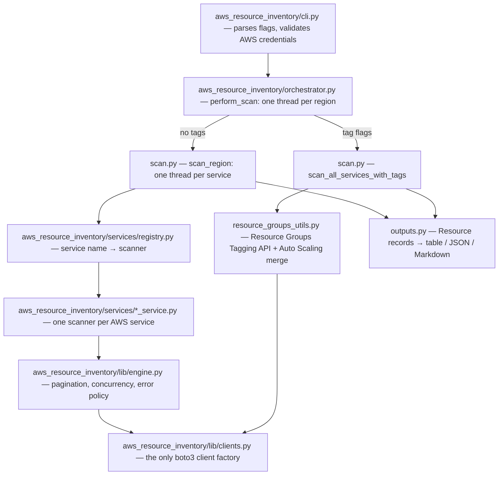

# Architecture

How `aws-inventory` turns one CLI command into a resource report. Read
this top to bottom once; each section is short.

## How a scan flows

Two paths, chosen by your flags:

1. No tag flags: every requested service is scanned with its own
   describe calls (the per-service path).
2. Any of `--tag-key`, `--tag-value`, `--all-services`: the Resource
   Groups Tagging API finds tagged resources across 100+ services (the
   tag path). Auto Scaling is not covered by that API, so its dedicated
   scanner runs too and the results are merged.

## The pieces

| Module | Job | The one fact to remember |
|---|---|---|
| `aws_resource_inventory/cli.py` | Flags, credential check, progress display | `--verbose`/`--log-file` are global: they go before `scan` |
| `aws_resource_inventory/orchestrator.py` | Fan out regions on threads | Picks per-service vs tag path |
| `aws_resource_inventory/lib/scan.py` | Fan out services per region; caching | Results cached 10 min per (region, service, tags) |
| `aws_resource_inventory/services/registry.py` | Service name → scanner + output processor | Adding a service is one entry here |
| `aws_resource_inventory/services/*_service.py` | One scanner per AWS service | Declarative ones are a `Describe` dict + 3-line function |
| `aws_resource_inventory/lib/engine.py` | Pagination, parallel collection, error guard, tag matching | Result always has exactly the requested keys; AWS errors degrade a key to `[]` with a warning, other errors surface |
| `aws_resource_inventory/lib/clients.py` | Builds every boto3 client | Connection pool 50, adaptive retries, thread-safe creation |
| `aws_resource_inventory/lib/records.py` | `Resource` — the typed record | Malformed records fail at construction, not at report time |
| `aws_resource_inventory/lib/outputs.py` | Records → table / JSON / Markdown | Caller states the scan path via `source=` — never guessed |
| `aws_resource_inventory/lib/cache.py` | Pickle cache with 10-min TTL | Best-effort: any cache failure is just a miss |

## The data shape

Every scanner returns `{result_key: [raw boto3 dicts]}` (for example
`{"vpcs": [...], "subnets": [...]}`). Output processors turn those into
`Resource` records — region, resource_type, resource_id, resource_arn,
optional resource_name — which all three output formats consume.

One subtlety: tag-path results are a hybrid. Most sections are Tagging
API shaped, but the merged Auto Scaling section carries raw service
dicts. The producer declares this (`SERVICE_SHAPED_SECTIONS` in
`resource_groups_utils.py`); the output layer routes those sections
through their registered processors instead of the generic one.

## Design rules that shaped this

1. The engine is a library the scanners call — not a framework that
   calls the scanners. Complicated scanners stay ordinary functions you
   can read top to bottom.
2. One registry, one client factory, one record type. Each exists
   exactly once; everything else uses them.
3. AWS errors are expected and degrade gracefully (empty key plus a
   warning). Anything else is a bug and is allowed to crash.
4. Decisions live in `docs/adr/`; product direction lives in
   `PRODUCT.md`.

## Adding a service

1. Create `aws_resource_inventory/services/<name>_service.py`: a `Describe` spec dict + a
   3-line `scan_<name>` (copy `vpc_service.py`), plus a
   `process_<name>_output` that builds `Resource` records.
2. Register it: one entry in `aws_resource_inventory/services/registry.py`.
3. Test it: `tests/test_<name>_scanner.py` (moto, written failing
   first) and add the processor to `tests/test_resource_shape.py`.
4. Update the README services table.

## How changes are verified

- `poetry run pytest` — the whole suite runs without AWS credentials
  (moto fakes AWS).
- `scripts/e2e-diff.sh` — after merging, scans real AWS with the code
  before and after the merge and diffs the output. Run it plain and
  with `--tag-key/--tag-value` (the two paths are different code).
