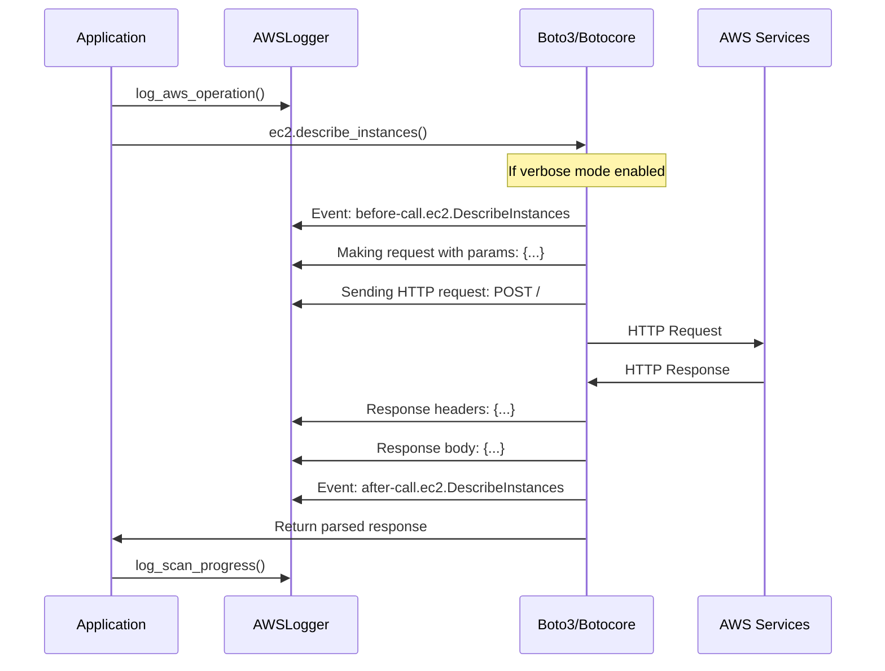

# AWS Resource Scanner - Logging Architecture Documentation

## Table of Contents
1. [Overview](#overview)
2. [AWS API Logging Explained](#aws-api-logging-explained)
3. [Core Functions and Components](#core-functions-and-components)
4. [Extending the Logging System](#extending-the-logging-system)
5. [Service Coverage](#service-coverage)
6. [External Integration](#external-integration)
7. [Architecture Flow Patterns](#architecture-flow-patterns)
8. [Configuration Examples](#configuration-examples)
9. [Troubleshooting](#troubleshooting)
10. [Code Cleanup Recommendations](#code-cleanup-recommendations)

## Overview

The AWS Resource Scanner implements a sophisticated, unified logging system designed to provide comprehensive visibility into AWS API interactions, application flow, and debugging information. The system supports multiple logging modes from basic application logging to detailed AWS API call tracing.

### Key Features
- **Unified Interface**: Single logging system for all components
- **Rich Console Output**: Color-coded, formatted console logging with Rich library
- **File Logging**: Detailed file logging with caller context
- **AWS API Tracing**: Comprehensive boto3/botocore API call logging
- **Progress Isolation**: Separate console streams for logs vs progress displays
- **Configurable Verbosity**: From basic info to full HTTP request/response tracing

## AWS API Logging Explained

### What is AWS API Logging?

AWS API logging captures detailed information about every interaction between the application and AWS services through the boto3/botocore libraries. This includes:

1. **HTTP Request Details**: Method, URL, headers, authentication
2. **Request Parameters**: All parameters sent to AWS APIs
3. **Response Data**: Status codes, headers, response bodies
4. **Timing Information**: Request duration and performance metrics
5. **Event System**: Internal boto3 event hooks and handlers
6. **Authentication Flow**: Credential resolution and signing process
7. **Retry Logic**: Retry attempts and backoff strategies

### Example of Captured Data

```
[DEBUG] Event before-call.ec2.DescribeInstances: calling handler <function>
[DEBUG] Making request for OperationModel(name=DescribeInstances) with params: {...}
[DEBUG] Sending http request: <AWSPreparedRequest method=POST, url=https://ec2.us-east-1.amazonaws.com/>
[DEBUG] Starting new HTTPS connection (1): ec2.us-east-1.amazonaws.com:443
[DEBUG] https://ec2.us-east-1.amazonaws.com:443 "POST / HTTP/1.1" 200 1234
[DEBUG] Response headers: {'x-amzn-RequestId': '12345-67890', ...}
[DEBUG] Response body: b'<DescribeInstancesResponse>...</DescribeInstancesResponse>'
```

## Core Functions and Components

### 1. AWSLogger Class (`aws_scanner_lib/logging.py`)

The central logging orchestrator that manages all logging functionality.

```python
class AWSLogger:
    """Main logging class with unified interface"""

    def __init__(self, name: str = "aws-scanner"):
        self.name = name
        self.logger = logging.getLogger(name)
        self._debug_mode = False
        self._verbose_mode = False
        self._log_file: Optional[Path] = None
        self._progress_console: Optional[Console] = None
        self._is_configured = False
```

#### Key Methods:

- **`configure(debug, log_file, verbose)`**: Main configuration method
- **`_enable_detailed_aws_logging()`**: Enables verbose AWS API tracing
- **`_suppress_noisy_loggers()`**: Suppresses third-party library noise
- **`_setup_file_logging()`**: Configures file output with detailed formatting

### 2. Configuration Functions

#### `configure_logging(debug, log_file, verbose) -> AWSLogger`
- **Location**: `aws_scanner_lib/logging.py:409`
- **Purpose**: Global configuration entry point
- **Parameters**:
  - `debug`: Enable debug mode
  - `log_file`: Optional log file path
  - `verbose`: Enable AWS API tracing (requires debug=True)

#### `get_logger(name) -> AWSLogger`
- **Location**: `aws_scanner_lib/logging.py:432`
- **Purpose**: Singleton logger retrieval
- **Returns**: Configured AWSLogger instance

#### `create_debug_log_file(log_file) -> Path`
- **Location**: `aws_scanner_lib/logging.py:456`
- **Purpose**: Smart log file path resolution
- **Handles**: Custom files, directories, default locations

### 3. AWS API Logging Implementation

#### `_enable_detailed_aws_logging()`
- **Location**: `aws_scanner_lib/logging.py:178`
- **Purpose**: Configure comprehensive AWS library logging
- **Configures**: 15+ AWS-related loggers at DEBUG level

```python
aws_loggers = {
    'boto3': logging.DEBUG,
    'boto3.session': logging.DEBUG,
    'boto3.resources': logging.DEBUG,
    'botocore': logging.DEBUG,
    'botocore.client': logging.DEBUG,
    'botocore.endpoint': logging.DEBUG,
    'botocore.httpsession': logging.DEBUG,
    'botocore.parsers': logging.DEBUG,
    'botocore.response': logging.DEBUG,
    'botocore.awsrequest': logging.DEBUG,
    'botocore.credentials': logging.INFO,  # Security consideration
    'urllib3.connectionpool': logging.DEBUG,
    'urllib3.util.retry': logging.DEBUG,
    'requests.packages.urllib3': logging.DEBUG,
    's3transfer': logging.DEBUG
}
```

### 4. Handler Management

The system ensures AWS logs are captured by:
1. Adding our file handlers to AWS loggers
2. Setting `propagate = False` to avoid duplicates
3. Configuring proper log levels per logger

## Extending the Logging System

### Adding New AWS Services

To add logging for additional AWS services:

1. **Update the logger configuration**:
```python
# In _enable_detailed_aws_logging()
aws_loggers.update({
    'botocore.dynamodb': logging.DEBUG,    # For DynamoDB
    'botocore.lambda': logging.DEBUG,      # For Lambda
    'botocore.rds': logging.DEBUG,         # For RDS
})
```

2. **Add service-specific logging methods**:
```python
def log_dynamodb_operation(self, table_name: str, operation: str, **kwargs):
    """Log DynamoDB operations with table context."""
    self.logger.debug("DynamoDB %s on table %s", operation, table_name, stacklevel=2)
```

### Adding Custom Log Handlers

```python
# Custom handler example
class CustomHandler(logging.Handler):
    def emit(self, record):
        # Custom processing logic
        pass

# Add to AWSLogger
logger = get_logger()
custom_handler = CustomHandler()
logger.logger.addHandler(custom_handler)
```

### Extending Verbosity Levels

```python
# Add new verbosity levels
def configure(self, debug=False, log_file=None, verbose=False, ultra_verbose=False):
    # ... existing code ...

    if ultra_verbose and verbose and debug:
        self._enable_ultra_verbose_logging()
    elif verbose and debug:
        self._enable_detailed_aws_logging()
    else:
        self._suppress_noisy_loggers()
```

## Service Coverage

### Currently Logged AWS Services
- **EC2**: Instance operations, volume management, security groups
- **S3**: Bucket operations, object management
- **VPC**: Network configuration, subnets, routing
- **ECS**: Container service operations
- **ELB**: Load balancer management
- **Auto Scaling**: Scaling group operations
- **STS**: Authentication and credential validation
- **Resource Groups**: Cross-service resource discovery

### AWS Libraries Monitored
- **boto3**: High-level AWS SDK
- **botocore**: Low-level AWS core library
- **urllib3**: HTTP connection pooling
- **requests**: HTTP library
- **s3transfer**: S3 transfer optimization

### Log Levels by Component
- **Application Logic**: INFO/DEBUG based on mode
- **AWS API calls**: DEBUG (verbose mode)
- **HTTP Transport**: DEBUG (verbose mode)
- **Credentials**: INFO (security consideration)
- **Third-party**: WARNING (unless verbose)

## External Integration

### Extracting Logging for External Use

#### 1. Standalone Logging Module

```python
# external_logging.py
from aws_scanner_lib.logging import AWSLogger, configure_logging

class ExternalAWSLogger:
    def __init__(self, service_name: str):
        self.logger = AWSLogger(service_name)

    def configure_for_service(self, debug=True, verbose=True, log_file=None):
        """Configure logging for external service"""
        self.logger.configure(debug=debug, log_file=log_file, verbose=verbose)
        return self.logger

# Usage in external service
external_logger = ExternalAWSLogger("my-service")
logger = external_logger.configure_for_service(
    debug=True,
    verbose=True,
    log_file="/path/to/service.log"
)
```

#### 2. Library Integration

```python
# For use in other Python packages
def setup_aws_logging(package_name: str, **config):
    """Setup AWS logging for external package"""
    from aws_scanner_lib.logging import configure_logging

    return configure_logging(
        debug=config.get('debug', False),
        log_file=config.get('log_file'),
        verbose=config.get('verbose', False)
    )
```

#### 3. Configuration Export

```python
# Export configuration for external systems
def export_logging_config():
    """Export logging configuration for external use"""
    return {
        'version': 1,
        'formatters': {
            'detailed': {
                'format': '%(asctime)s.%(msecs)03d | %(name)s | %(levelname)-8s | %(pathname)s:%(funcName)s:%(lineno)d | %(message)s',
                'datefmt': '%Y-%m-%d %H:%M:%S'
            }
        },
        'handlers': {
            'file': {
                'class': 'logging.FileHandler',
                'formatter': 'detailed',
                'filename': 'aws_api.log'
            }
        },
        'loggers': {
            'boto3': {'level': 'DEBUG'},
            'botocore': {'level': 'DEBUG'},
            'urllib3': {'level': 'DEBUG'}
        }
    }
```

## Architecture Flow Patterns

### 1. Initialization Flow

```mermaid
graph TD
    A[CLI Startup] --> B[Parse Global Args]
    B --> C{--verbose flag?}
    C -->|Yes| D[Set app_verbose = True]
    C -->|No| E[Set app_verbose = False]
    D --> F[configure_logging(debug, log_file, verbose)]
    E --> F
    F --> G[AWSLogger.configure()]
    G --> H{verbose && debug?}
    H -->|Yes| I[_enable_detailed_aws_logging()]
    H -->|No| J[_suppress_noisy_loggers()]
    I --> K[Setup AWS Logger Handlers]
    J --> K
    K --> L[Ready for AWS Operations]
```

### 2. AWS API Call Flow



### 3. File Logging Architecture

```
┌─────────────────────────────────────────────────────────────────┐
│                     Logging Architecture                        │
├─────────────────────────────────────────────────────────────────┤
│  Console Output (stdout)     │    File Output (debug.log)       │
│  ┌─────────────────────────┐  │  ┌─────────────────────────────┐ │
│  │ RichHandler             │  │  │ FileHandler                 │ │
│  │ - Colored output        │  │  │ - Detailed format           │ │
│  │ - Time stamps           │  │  │ - Full caller context       │ │
│  │ - INFO/DEBUG levels     │  │  │ - All debug messages        │ │
│  └─────────────────────────┘  │  └─────────────────────────────┘ │
├─────────────────────────────────────────────────────────────────┤
│                    Progress Display (stderr)                    │
│  ┌─────────────────────────────────────────────────────────────┐ │
│  │ Rich Live Console                                           │ │
│  │ - Progress bars, spinners                                   │ │
│  │ - Real-time updates                                         │ │
│  │ - Isolated from logging output                              │ │
│  └─────────────────────────────────────────────────────────────┘ │
└─────────────────────────────────────────────────────────────────┘
```

### 4. Logger Hierarchy

```
Root Logger
├── aws-scanner (AWSLogger)
│   ├── RichHandler (console)
│   └── FileHandler (debug.log)
├── boto3 → [forwards to aws-scanner handlers]
├── botocore → [forwards to aws-scanner handlers]
├── urllib3 → [forwards to aws-scanner handlers]
└── requests → [forwards to aws-scanner handlers]
```

## Configuration Examples

### Basic Debug Logging
```bash
aws-scanner scan --debug
```
- Enables debug output to console and file
- Suppresses noisy third-party loggers
- Standard application debug information

### Verbose AWS API Tracing
```bash
aws-scanner --verbose scan --debug
```
- Enables all AWS API call logging
- Captures HTTP request/response details
- Shows boto3/botocore internal events

### Custom Log File
```bash
aws-scanner --verbose --log-file /tmp/aws-trace.log scan --debug
```
- Saves verbose output to custom file
- Full API tracing with detailed formatting

### Multiple Services with Timing
```bash
aws-scanner --verbose scan --debug --service ec2,s3,vpc --max-workers 1
```
- Traces multiple AWS services
- Sequential execution for clear logging
- Performance timing information

## Troubleshooting

### Common Issues

1. **No AWS API logs visible**
   - Ensure both `--debug` and `--verbose` flags are used
   - Check that log file is specified for file output
   - Verify no conflicting log level configurations

2. **Duplicate log entries**
   - Check logger propagation settings
   - Ensure handlers aren't added multiple times
   - Verify logger hierarchy configuration

3. **Missing caller context**
   - Verify `stacklevel` parameter in logging calls
   - Check file formatter configuration
   - Ensure proper method signatures

4. **Performance impact**
   - Verbose logging adds ~10-20% overhead
   - Use selectively for debugging
   - Consider log level filtering for production

### Debug Commands

```bash
# Test logging configuration
aws-scanner --verbose scan --debug --dry-run

# Check log file output
tail -f /path/to/debug.log | grep -E "(boto|botocore|HTTP)"

# Verify handler configuration
python -c "import logging; print(logging.getLogger('boto3').handlers)"
```

## Code Cleanup Recommendations

After analyzing the codebase, here are the identified cleanup opportunities:

### 1. Unused/Redundant Code

#### In `aws_scanner_lib/logging.py`:

1. **Unused emoji constants**:
   - Lines with 🔧, 🌐, 🔍, 📡 emojis could be centralized into constants

2. **Redundant logging method**:
   - `log_aws_operation()` (line 334) has overlapping functionality with specialized methods
   - Consider consolidating or removing unused branches

3. **Unused imports potential**:
   - `contextmanager` import (line 21) - verify all usages
   - Some type hints may be over-specified

#### In CLI integration:

1. **Global variable duplication**:
   - `app_log_file` and `app_verbose` globals could be consolidated into a config object
   - Current pattern works but could be more maintainable

### 2. Inconsistent Patterns

1. **Mixed logging interfaces**:
   - Some places use `logger.debug()` directly
   - Others use `self.logger.debug()`
   - Consider standardizing on one approach

2. **Handler configuration**:
   - AWS logger handler setup could be extracted into a separate method
   - Current inline approach works but reduces testability

### 3. Potential Optimizations

1. **Logger creation overhead**:
   - Multiple `logging.getLogger()` calls could be cached
   - Consider lazy initialization for AWS loggers

2. **String formatting**:
   - Some debug messages use f-strings, others use % formatting
   - Standardize on one approach for consistency

### 4. Documentation Gaps

1. **Missing docstrings**:
   - Some private methods lack docstrings
   - Parameter documentation could be more detailed

2. **Type hints**:
   - Some return types could be more specific
   - Consider adding `TypedDict` for config parameters

### Recommended Cleanup Actions:

1. **Phase 1**: Remove obviously unused code and imports
2. **Phase 2**: Standardize string formatting and logging patterns
3. **Phase 3**: Consolidate similar functionality
4. **Phase 4**: Add missing documentation and improve type hints
5. **Phase 5**: Consider architectural improvements for better testability

The logging system is well-designed and functional. These cleanup suggestions would improve maintainability without affecting core functionality.
