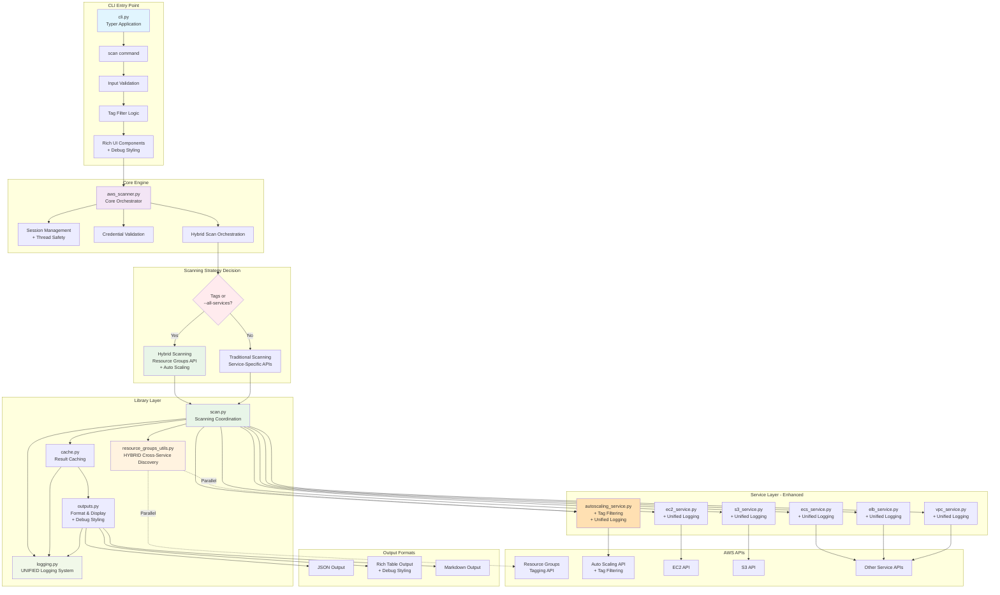
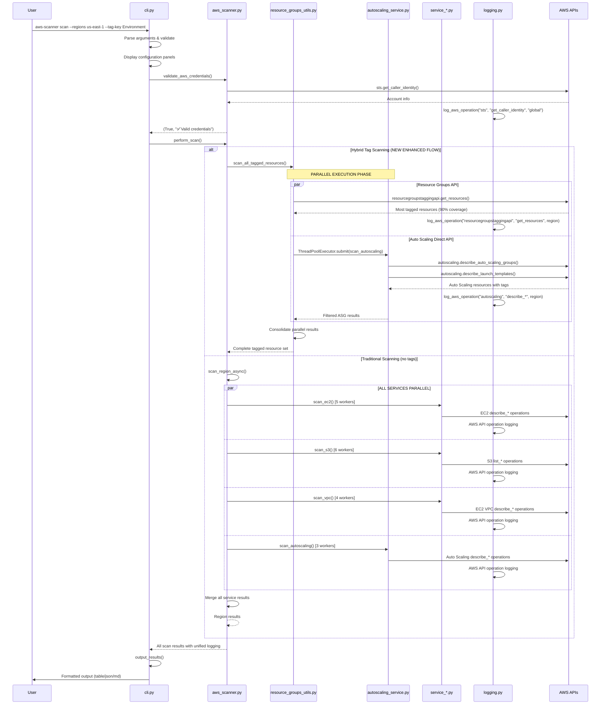
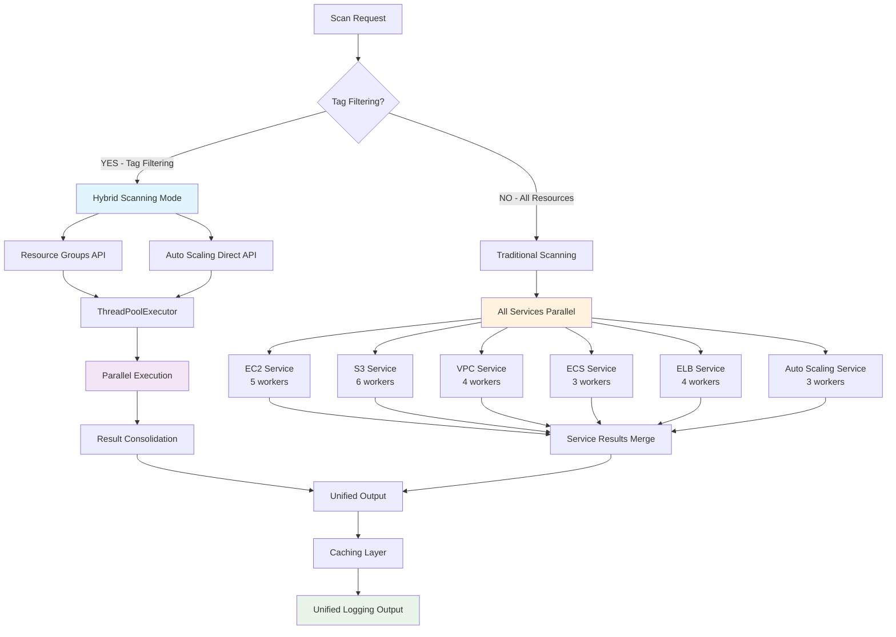
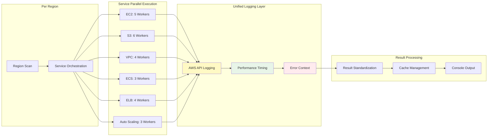
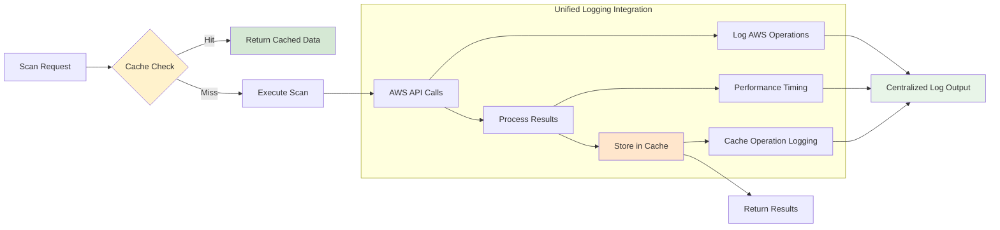
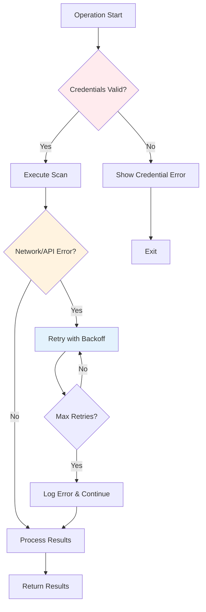

# AWS Scanner Architecture Documentation

## Table of Contents
- [Project Overview](#project-overview)
- [Architecture Overview](#architecture-overview)
- [System Architecture Diagram](#system-architecture-diagram)
- [Module Documentation](#module-documentation)
  - [CLI Module](#1-cli-module-clipy)
  - [Core Engine](#2-core-engine-aws_scannerpy)
  - [Scanning Library](#3-scanning-library-aws_scanner_lib)
    - [Unified Logging System](#31-unified-logging-system-loggingpy)
    - [Scan Coordination](#32-scan-coordination-scanpy)
    - [Hybrid Cross-Service Discovery](#33-hybrid-cross-service-discovery-resource_groups_utilspy)
    - [Caching System](#34-caching-system-cachepy)
    - [Output Formatting](#35-output-formatting-outputspy)
  - [Service Layer](#4-service-layer-services)
- [Data Flow Analysis](#data-flow-analysis)
- [API Reference](#api-reference)
  - [CLI API](#1-cli-api)
  - [Core Functions API](#2-core-functions-api)
  - [Scanning Library API](#3-scanning-library-api)
  - [Unified Logging API](#4-unified-logging-api)
  - [Caching API](#5-caching-api)
  - [Output API](#6-output-api)
  - [Service Interface Contract](#7-service-interface-contract)
- [Configuration & Usage](#configuration--usage)
- [Extending the Scanner](#extending-the-scanner)

## Project Overview

The AWS Multi-Service Scanner is a comprehensive Python tool designed to discover, scan, and inventory AWS resources across multiple services and regions. It provides both traditional service-specific scanning and advanced hybrid cross-service scanning using AWS Resource Groups Tagging API with Auto Scaling integration.

### Key Features
- **Multi-service scanning**: EC2, S3, ECS, ELB, VPC, Auto Scaling
- **Hybrid cross-service discovery**: 100+ AWS services via Resource Groups API + Auto Scaling parallel execution
- **Tag-based filtering**: Server-side filtering for optimal performance with Auto Scaling integration
- **Multi-region support**: Parallel scanning across regions with configurable workers
- **Multiple output formats**: JSON, Table, Markdown with enhanced styling
- **Intelligent caching**: 10-minute TTL with automatic cache management
- **Rich CLI interface**: Progress bars, configuration panels, colored output with debug styling
- **Unified logging system**: Comprehensive debug mode with AWS API tracing, file logging, and structured output
- **Graceful shutdown**: Signal handling for clean termination
- **Performance optimization**: ThreadPoolExecutor with configurable parallelism across regions and services

## Architecture Overview

The AWS Scanner follows a modular, layered architecture designed for maintainability, extensibility, and performance with hybrid scanning capabilities:

```
┌─────────────────────────────────────────────────────────────────┐
│                        CLI Layer (cli.py)                       │
│  ┌──────────────────┐ ┌──────────────────┐ ┌─────────────────┐  │
│  │    Commands      │ │   Validation     │ │   UI/Progress   │  │
│  │   - scan         │ │  - Args parsing  │ │  - Rich panels  │  │
│  │   - dry-run      │ │  - Input checks  │ │  - Progress bars│  │
│  │   - debug mode   │ │  - Tag filters   │ │  - Debug styling│  │
│  └──────────────────┘ └──────────────────┘ └─────────────────┘  │
└─────────────────────────────────────────────────────────────────┘
                                    │
                                    ▼
┌─────────────────────────────────────────────────────────────────┐
│                   Core Logic Layer (aws_scanner.py)             │
│  ┌──────────────────┐ ┌──────────────────┐ ┌─────────────────┐  │
│  │   Session Mgmt   │ │   Orchestration  │ │   Credential    │  │
│  │  - Connection    │ │  - Hybrid scan   │ │   Validation    │  │
│  │    pooling       │ │    routing       │ │  - STS calls    │  │
│  │  - Thread safety │ │  - Result agg.   │ │  - Profile mgmt │  │
│  └──────────────────┘ └──────────────────┘ └─────────────────┘  │
└─────────────────────────────────────────────────────────────────┘
                                    │
                        ┌───────────┴───────────┐
                        ▼                       ▼
┌─────────────────────────────────┐ ┌─────────────────────────────────┐
│      Library Layer              │ │      Service Layer              │
│    (aws_scanner_lib/)           │ │       (services/)               │
│ ┌─────────────────────────────┐ │ │ ┌─────────────────────────────┐ │
│ │        scan.py              │ │ │ │      ec2_service.py         │ │
│ │ - Region scanning           │ │ │ │    - EC2 instances          │ │
│ │ - Service coordination      │ │ │ │    - Volumes, AMIs          │ │
│ │ - Hybrid scan routing       │ │ │ │    - Security groups        │ │
│ │                             │ │ │ │    - Unified logging        │ │
│ ├─────────────────────────────┤ │ │ └─────────────────────────────┘ │
│ │   resource_groups_utils.py  │ │ │ ┌─────────────────────────────┐ │
│ │ - Resource Groups API       │ │ │ │      s3_service.py          │ │
│ │ - HYBRID scanning           │ │ │ │    - S3 buckets             │ │
│ │ - Auto Scaling integration  │ │ │ │    - Bucket policies        │ │
│ │ - ARN parsing               │ │ │ │    - Unified logging        │ │
│ │ - Parallel execution        │ │ │ └─────────────────────────────┘ │
│ ├─────────────────────────────┤ │ │ ┌─────────────────────────────┐ │
│ │       cache.py              │ │ │ │   autoscaling_service.py    │ │
│ │ - Result caching            │ │ │ │    - ASGs with tag filter   │ │
│ │ - TTL management            │ │ │ │    - Launch configs         │ │
│ │ - Cache key generation      │ │ │ │    - Launch templates       │ │
│ │                             │ │ │ │    - Tag filtering logic    │ │
│ ├─────────────────────────────┤ │ │ │    - Unified logging        │ │
│ │      outputs.py             │ │ │ └─────────────────────────────┘ │
│ │ - Output formatting         │ │ │ ┌─────────────────────────────┐ │
│ │ - Rich table creation       │ │ │ │    [Other Services...]      │ │
│ │ - Markdown generation       │ │ │ │  - ECS, ELB, VPC            │ │
│ │ - Debug styling             │ │ │ │  - Consistent interface     │ │
│ ├─────────────────────────────┤ │ │ │  - Unified logging          │ │
│ │      logging.py             │ │ │ └─────────────────────────────┘ │
│ │ - UNIFIED logging system    │ │ └─────────────────────────────────┘
│ │ - AWS API call tracing      │ │
│ │ - Debug mode management     │ │
│ │ - File & console output     │ │
│ │ - Timer functionality       │ │
│ │ - Error context logging     │ │
│ └─────────────────────────────┘ │
└─────────────────────────────────┘
```

### Key Architectural Innovations

1. **Hybrid Scanning Architecture**: Combines Resource Groups API with Auto Scaling service scanning in parallel for complete tag-based discovery
2. **Unified Logging System**: All services use the same enhanced logging infrastructure with AWS API tracing
3. **Tag-Aware Service Integration**: Auto Scaling service implements tag filtering to complement Resource Groups API
4. **Performance-Optimized Parallel Execution**: ThreadPoolExecutor usage across all layers for maximum throughput

## System Architecture Diagram



## Module Documentation

### 1. CLI Module (`cli.py`)

**Purpose**: Command-line interface and user interaction layer

#### Key Components:

##### Main Application Setup
```python
app = typer.Typer(
    name="aws-scanner",
    help="AWS Multi-Service Scanner\n\nScan multiple AWS services across regions with optional tag filtering\n\nUse the 'scan' command to start scanning AWS resources.",
    add_completion=True,
)
```

##### Global Options
```python
@app.callback()
def main(
    log_file: Optional[Path] = typer.Option(
        None,
        "--log-file",
        "-l",
        help="Global log file path for debug output (applies to all commands with --debug argument)",
    ),
    verbose: bool = typer.Option(
        False,
        "--verbose",
        "-v",
        help="Enable verbose AWS API call tracing (use with --debug for detailed boto3/botocore logging)",
    ),
) -> None:
    """
    Global configuration for all commands.
    Sets up logging configuration that applies to all subcommands.
    """
```

##### Core Command: `scan`
```python
@app.command(name="scan")
def scan_command(
    regions: Optional[str] = None,            # Comma-separated regions
    services: List[str] = SUPPORTED_SERVICES, # Services to scan
    profile: Optional[str] = None,            # AWS profile
    tag_key: Optional[str] = None,            # Tag key filter
    tag_value: Optional[str] = None,          # Tag value filter
    output_file: Optional[Path] = None,       # Output file path
    output_format: str = "table",             # Output format
    compare: bool = False,                    # Compare mode
    dry_run: bool = False,                    # Dry run mode
    max_workers: int = 8,                     # Region parallelism
    service_workers: int = 4,                 # Service parallelism
    use_cache: bool = True,                   # Enable caching
    refresh: bool = False,                    # Continuous refresh
    refresh_interval: int = 10,               # Refresh interval
    all_services: bool = False,               # Cross-service mode
    debug: bool = False,                      # Debug mode with detailed logging
) -> None:
```

##### UI Helper Functions:
- `_display_configuration_panel()`: Shows scan configuration
- `_display_regions_panel()`: Shows target regions
- `_handle_dry_run()`: Handles dry-run mode
- `_display_scan_start_message()`: Shows scan initiation
- `_display_scan_completion()`: Shows scan results summary

### 2. Core Engine (`aws_scanner.py`)

**Purpose**: Central orchestration and core business logic

#### Key Functions:

##### Session Management
```python
def get_session(profile_name: Optional[str] = None) -> boto3.Session:
    """Thread-safe AWS session creation with connection pooling"""
    # Implements double-check locking pattern
    # Manages session pool for connection reuse
```

##### Credential Validation
```python
def validate_aws_credentials(
    session: boto3.Session,
    profile_name: Optional[str] = None
) -> tuple[bool, str]:
    """
    Validates AWS credentials using STS get-caller-identity

    Returns:
        tuple: (is_valid: bool, message: str)
    """
```

##### Scan Orchestration
```python
def perform_scan(
    session: boto3.Session,
    region_list: List[str],
    services: List[str],
    tag_key: Optional[str] = None,
    tag_value: Optional[str] = None,
    max_workers: int = 8,
    service_workers: int = 4,
    use_cache: bool = True,
    progress: Optional[Progress] = None,
    all_services: bool = False,
    shutdown_event: Optional[threading.Event] = None,
) -> Dict[str, Dict[str, Any]]:
    """
    Main scan orchestration with intelligent routing:

    Scanning Strategy Decision:
    - If (all_services OR tag_key OR tag_value): Use Resource Groups API
    - Else: Use traditional service-specific scanning
    """
```

##### Display Functions
```python
def display_region_summaries(all_results: Dict[str, Dict[str, Any]]) -> None:
    """Displays region-wise resource summaries with Rich tables"""

def check_and_display_cache_status(...) -> bool:
    """Checks and displays cached results availability"""
```

### 3. Scanning Library (`aws_scanner_lib/`)

#### 3.1 Unified Logging System (`logging.py`)

**Purpose**: Comprehensive unified logging system for AWS resource scanner with advanced features

##### Key Components:

```python
class AWSLogger:
    """
    AWS Scanner Logger - UNIFIED logging system for all services.

    Features:
    - Rich console output with proper formatting
    - File logging for debug sessions with caller information
    - Console/progress separation to prevent Live display conflicts
    - Debug mode switching
    - AWS library noise suppression
    - Correct caller context (file:function:line)
    - Performance timing capabilities
    - AWS API call tracking
    - Enhanced boto3 request/response logging
    - Error context logging with structured data
    """
```

##### Core Functions:
```python
def configure_logging(
    debug: bool = False,
    log_file: Optional[Path] = None,
    verbose: bool = False
) -> AWSLogger:
    """
    Configure and return the AWS scanner logging system.

    Args:
        debug: Enable debug mode with verbose logging
        log_file: Optional file path for debug log output
        verbose: Enable verbose AWS API call tracing (requires debug=True)

    Features:
        - Automatic timestamp-based debug log file creation
        - Rich console handlers with structured formatting
        - AWS library logging configuration
        - Boto3/botocore enhanced logging when verbose=True
    """

def get_logger(name: str = "aws-scanner") -> AWSLogger:
    """
    Get unified logger instance for any service.

    Returns:
        AWSLogger: Enhanced logger with AWS-specific features

    Usage:
        All services now use: logger = get_logger("service_name")
    """

def get_output_console() -> Console:
    """
    Get the progress console for Live displays (uses stderr).
    Prevents conflicts with standard logging output.
    """
```

##### Advanced Logging Features:
- **Unified Service Integration**: All services (EC2, S3, ECS, ELB, VPC, Auto Scaling) use the same logging system
- **AWS API Tracing**: Detailed boto3/botocore call logging with `--verbose` flag
- **File Logging**: Debug sessions with caller information and timestamps in `.debug_logs/`
- **Performance Timing**: Context manager for operation timing with `logger.timer()`
- **Error Context**: Enhanced error logging with contextual information via `logger.log_error_context()`
- **Console Output Separation**: Logs use stdout, progress displays use stderr
- **Debug File Management**: Automatic timestamped debug files with configurable paths

#### 3.2 Scan Coordination (`scan.py`)

**Purpose**: Coordinates scanning operations and provides unified interface

##### Core Functions:

```python
def scan_all_services_with_tags(
    session: boto3.Session,
    region: str,
    tag_key: Optional[str] = None,
    tag_value: Optional[str] = None,
    use_cache: bool = True,
) -> Tuple[str, Dict[str, Any], float]:
    """
    Cross-service scanning using Resource Groups API

    Flow:
    1. Check cache for 'all_services' key
    2. Delegate to resource_groups_utils.scan_all_tagged_resources()
    3. Cache results with 'all_services' service name
    4. Return (region, results, duration) tuple
    """

def scan_region(
    session: boto3.Session,
    region: str,
    services: List[str],
    tag_key: Optional[str] = None,
    tag_value: Optional[str] = None,
    service_workers: int = 4,
    use_cache: bool = True,
    progress_callback: Optional[Any] = None,
    shutdown_event: Optional[Any] = None,
) -> Tuple[str, Dict[str, Any], float]:
    """
    Traditional service-specific scanning

    Flow:
    1. Create ThreadPoolExecutor with service_workers
    2. Submit scan_service() tasks for each service
    3. Collect results as futures complete
    4. Handle graceful shutdown via shutdown_event
    """

def scan_service(
    session: boto3.Session,
    region: str,
    service: str,
    tag_key: Optional[str] = None,
    tag_value: Optional[str] = None,
    use_cache: bool = True,
) -> Dict[str, Any]:
    """
    Routes to appropriate service scanner

    Service Routing:
    - ec2 -----------> scan_ec2()
    - s3  -----------> scan_s3()
    - ecs -----------> scan_ecs()
    - elb -----------> scan_elb()
    - vpc -----------> scan_vpc()
    - autoscaling ---> scan_autoscaling()
    """
```

#### 3.3 Hybrid Cross-Service Discovery (`resource_groups_utils.py`)

**Purpose**: Advanced hybrid scanning combining AWS Resource Groups Tagging API with Auto Scaling service integration

##### Key Functions:

```python
def scan_all_tagged_resources(
    session: Any,
    region: str,
    tag_key: Optional[str] = None,
    tag_value: Optional[str] = None,
) -> Dict[str, Any]:
    """
    HYBRID function for cross-service resource discovery

    Innovation: Combines Resource Groups API + Auto Scaling in parallel

    Architecture:
    1. ThreadPoolExecutor with 2 workers
    2. Parallel execution: Resource Groups API + Auto Scaling tag filtering
    3. Result consolidation with output-compatible format

    Why Hybrid:
    - Resource Groups API: Supports 100+ AWS services BUT excludes Auto Scaling
    - Auto Scaling Service: Directly supports tag filtering for ASGs/Launch Templates
    - Parallel execution: No performance penalty for comprehensive coverage

    Returns: Service-organized resource dictionary with complete coverage
    """

def get_all_tagged_resources_across_services(
    session: Any,
    region: str,
    tag_key: Optional[str] = None,
    tag_value: Optional[str] = None,
) -> Dict[str, Any]:
    """
    Core Resource Groups API implementation

    Process:
    1. Build tag filters based on input parameters
    2. Paginate through get_resources() results
    3. Extract service/type from ARNs using _extract_service_and_type_from_arn()
    4. Create standardized resource objects

    Server-side Filtering:
    - ResourceTypeFilters: None (discover ALL services)
    - TagFilters: Applied at AWS API level for optimal performance
    """

def _extract_service_and_type_from_arn(arn: str) -> tuple[str, str]:
    """
    Enhanced ARN parsing for 100+ AWS services

    ARN Format: arn:aws:service:region:account:resource-type/resource-id
    Returns: (service_name, resource_type)

    Special Handling:
    - S3: arn:aws:s3:::bucket-name (no region/account)
    - ELB: Complex path-based resource types
    - Auto Scaling: Multiple resource types (groups, configs, templates)
    """
```

##### Hybrid Scanning Process:

```python
# ThreadPoolExecutor coordination
with ThreadPoolExecutor(max_workers=2) as executor:
    # Submit Resource Groups API scan
    rg_future = executor.submit(
        get_all_tagged_resources_across_services, session, region, tag_key, tag_value
    )

    # Submit Auto Scaling scan with tag filtering
    asg_future = executor.submit(
        scan_autoscaling, session, region, tag_key, tag_value
    )

    # Collect and consolidate results
    # Resource Groups API: 100+ services (excluding Auto Scaling)
    # Auto Scaling Service: ASGs + Launch Templates + Launch Configurations
```

##### Architecture Benefits:
- **Complete Coverage**: Resource Groups API + Auto Scaling = 100% tag-filtered discovery
- **No Performance Impact**: Parallel execution maintains speed
- **Unified Results**: Single output format compatible with existing processing
- **Error Resilience**: Either scan can fail without affecting the other

#### 3.4 Caching System (`cache.py`)

**Purpose**: Intelligent caching with TTL management

##### Cache Configuration:
```python
CACHE_DIR = Path("/tmp/aws_scanner_cache")
CACHE_TTL_MINUTES = 10
```

##### Core Functions:
```python
def get_cache_key(
    region: str,
    service: str,
    tag_key: Optional[str] = None,
    tag_value: Optional[str] = None,
) -> str:
    """
    Generates MD5 cache key from parameters
    Format: "{region}:{service}:{tag_key}:{tag_value}"
    """

def get_cached_result(...) -> Optional[Dict[str, Any]]:
    """
    Retrieves cached result if available and not expired

    Process:
    1. Check if cache file exists
    2. Verify cache age < TTL
    3. Return deserialized data or None
    """

def cache_result(...) -> None:
    """
    Stores scan result in cache

    Uses pickle serialization for complex data structures
    Handles errors gracefully (continues without caching)
    """
```

#### 3.5 Output Formatting (`outputs.py`)

**Purpose**: Multi-format output generation and display

##### Key Constants:
```python
TABLE_MINIMUM_WIDTH = 86  # Ensures readable table formatting
```

##### Core Functions:
```python
def create_aws_resources_table(
    flattened_resources: List[Dict[str, Any]],
    debug: bool
) -> Table:
    """
    Creates standardized Rich Table for resource display

    Args:
        flattened_resources: List of resource dictionaries
        debug: Enable debug styling (green border instead of blue)

    Columns:
    - Region (blue)
    - Resource Type (yellow) - format: service:type
    - Resource ID (green)
    - Resource ARN (white)
    """

def output_results(
    results: Dict[str, Any],
    output_file: Path,
    output_format: str,
    debug: bool,
) -> int:
    """
    Main output function supporting multiple formats

    Args:
        results: Scan results dictionary
        output_file: Path for output file
        output_format: Output format (json|table|md|markdown)
        debug: Enable debug mode styling

    Returns:
        int: Total number of flattened resources found

    Formats:
    - json: Raw JSON data
    - table: Rich table display
    - md/markdown: Markdown report with summaries
    """

def generate_markdown_summary(
    flattened_resources: List[Dict[str, Any]],
    results: Dict[str, Any]
) -> str:
    """
    Generates comprehensive Markdown report

    Sections:
    - Executive summary with counts
    - Summary by region
    - Summary by service
    - Summary by resource type
    - Detailed resource listings
    """
```

### 4. Service Layer (`services/`)

Each service module follows a consistent interface pattern with unified logging:

#### Interface Contract:
```python
def scan_[service](
    session: boto3.Session,
    region: str,
    tag_key: Optional[str] = None,  # NEW: Tag filtering support
    tag_value: Optional[str] = None  # NEW: Tag filtering support
) -> Dict[str, Any]:
    """
    Service-specific scanning implementation with unified logging

    Returns:
        Dict with resource type keys and resource lists as values
    """

def process_[service]_output(
    service_data: Dict[str, Any],
    region: str,
    flattened_resources: List[Dict[str, Any]]
) -> None:
    """
    Converts raw API results to standardized format

    Updates:
        flattened_resources list with standardized resource dictionaries
    """
```

#### Universal Service Features:
All services now implement:
- **Unified Logging**: `from aws_scanner_lib.logging import get_logger, get_output_console`
- **AWS API Operation Logging**: `logger.log_aws_operation("service", "operation", region)`
- **Performance Timing**: `with logger.timer(f"Service scan in {region}"):`
- **Error Context**: `logger.log_error_context(e, {"service": "name", "region": region})`
- **ThreadPoolExecutor**: Parallel scanning with configurable workers
- **Progress Output**: Debug mode console output via `output_console`

#### Service-Specific Implementations:

##### Auto Scaling Service (`autoscaling_service.py`) - ENHANCED
```python
# MAJOR UPDATE: Full tag filtering support + unified logging

# Scanned Resource Types with Tag Filtering:
- Auto Scaling Groups (describe_auto_scaling_groups + tag filtering)
- Launch Configurations (filtered by matching ASG references)
- Launch Templates (describe_launch_templates + tag filtering)

# Tag Filtering Logic:
- tag_key + tag_value: Exact match required
- tag_key only: Key must exist (any value)
- tag_value only: Value must exist (any key)
- No tags: Return all resources

def scan_autoscaling(
    session: boto3.Session,
    region: str,
    tag_key: Optional[str] = None,
    tag_value: Optional[str] = None
) -> Dict[str, Any]:
    """
    Enhanced scanning with:
    - Unified logging system
    - Tag filtering for ASGs and Launch Templates
    - ThreadPoolExecutor with AUTOSCALING_MAX_WORKERS = 3
    - Performance timing and AWS API operation logging
    - Launch Configurations filtered by matching ASG references
    """
```

##### EC2 Service (`ec2_service.py`) - UPDATED
```python
# Scanned Resource Types:
- EC2 Instances (describe_instances)
- EBS Volumes (describe_volumes)
- Security Groups (describe_security_groups)
- AMIs (describe_images)
- EBS Snapshots (describe_snapshots)

# NEW: Unified logging integration
EC2_MAX_WORKERS = 5

def scan_ec2(session: boto3.Session, region: str) -> Dict[str, Any]:
    """
    Enhanced with:
    - Unified logging system
    - AWS API operation logging
    - Performance timing
    - Enhanced error handling with context
    """
```

##### S3 Service (`s3_service.py`) - UPDATED
```python
# Scanned Resource Types:
- S3 Buckets (list_buckets, get_bucket_*)
- Bucket region filtering
- Bucket tags and metadata

# NEW: Unified logging integration
S3_MAX_WORKERS = 6

def scan_s3(session: boto3.Session, region: str) -> Dict[str, Any]:
    """
    Enhanced with:
    - Unified logging system
    - Performance timing for bucket processing
    - Enhanced error handling
    """
```

##### VPC Service (`vpc_service.py`) - UPDATED
```python
# Scanned Resource Types:
- VPCs (describe_vpcs)
- Subnets (describe_subnets)
- Internet Gateways (describe_internet_gateways)
- Route Tables (describe_route_tables)
- NAT Gateways (describe_nat_gateways)
- DHCP Options (describe_dhcp_options)

# NEW: Unified logging integration
VPC_MAX_WORKERS = 4

def scan_vpc(session: boto3.Session, region: str) -> Dict[str, Any]:
    """
    Enhanced with:
    - Unified logging system
    - Performance timing
    - AWS API operation logging
    """
```

## Data Flow Analysis (ENHANCED HYBRID ARCHITECTURE)

### 1. Enhanced Command Execution Flow



### 2. Enhanced Hybrid Scanning Architecture



### 3. Enhanced Service-Level Performance Flow



### 2. Enhanced Caching Flow with Unified Logging



### 3. Error Handling Flow



## API Reference (ENHANCED)

### 1. Enhanced CLI API

#### Global Options

**Syntax:**
```bash
aws-scanner [GLOBAL-OPTIONS] COMMAND [COMMAND-OPTIONS]
```

**Enhanced Global Options:**

| Option | Short | Type | Default | Description |
|--------|-------|------|---------|-------------|
| `--log-file` | `-l` | `Path` | `None` | Global log file path for unified debug output |
| `--verbose` | `-v` | `bool` | `False` | Enable verbose AWS API call tracing with timing |

#### Command: `aws-scanner scan` (ENHANCED)

**Syntax:**
```bash
aws-scanner [GLOBAL-OPTIONS] scan [OPTIONS]
```

**Enhanced Options with New Features:**

| Option | Short | Type | Default | Description |
|--------|-------|------|---------|-------------|
| `--regions` | `-r` | `str` | EU+US regions | Comma-separated AWS regions |
| `--service` | `-s` | `List[str]` | All supported | AWS services to scan (ec2,s3,vpc,ecs,elb,autoscaling) |
| `--profile` | `-p` | `str` | `None` | AWS profile to use |
| `--tag-key` | | `str` | `None` | **NEW: Hybrid tag filtering by key** |
| `--tag-value` | | `str` | `None` | **NEW: Hybrid tag filtering by value** |
| `--output` | `-o` | `Path` | Auto-generated | Output file path |
| `--format` | `-f` | `str` | `table` | Output format (json\|table\|md) |
| `--compare` | `-c` | `bool` | `False` | Compare with existing results |
| `--dry-run` | | `bool` | `False` | Show scan plan without execution |
| `--max-workers` | `-w` | `int` | `8` | Region parallelism (1-20) |
| `--service-workers` | | `int` | `4` | Service parallelism (1-10) |
| `--cache/--no-cache` | | `bool` | `True` | Enable/disable caching |
| `--refresh` | | `bool` | `False` | Continuous refresh mode |
| `--refresh-interval` | `-i` | `int` | `10` | Refresh interval (5-300s) |
| `--all-services` | | `bool` | `False` | Use Resource Groups API |
| `--debug` | `-d` | `bool` | `False` | **ENHANCED: Enable unified debug logging** |

**Enhanced Examples:**
```bash
# Basic EC2 scan with unified logging
aws-scanner scan --regions us-east-1 --service ec2 --debug

# NEW: Hybrid tag filtering (Resource Groups API + Auto Scaling)
aws-scanner scan --tag-key Environment --tag-value Production

# NEW: Tag key only filtering (any value)
aws-scanner scan --tag-key Team --regions us-east-1,eu-west-1

# Enhanced debug with AWS API operation logging
aws-scanner --verbose scan --debug --regions us-east-1 --service autoscaling

# NEW: Auto Scaling specific scan with tag filtering
aws-scanner scan --service autoscaling --tag-key Application --debug

# Enhanced performance scan with all new logging
aws-scanner --log-file ./scan.log --verbose scan --debug --max-workers 12

# NEW: Cross-service hybrid scan
aws-scanner scan --tag-key Environment --all-services --debug
```

### 2. Enhanced Core Functions API

#### Session Management with Unified Logging
```python
# Enhanced with unified logging integration
from aws_scanner_lib.logging import get_logger, get_output_console

def validate_aws_credentials(
    session: boto3.Session,
    profile: Optional[str] = None
) -> Tuple[bool, str]:
    """
    Enhanced with unified logging for credential validation

    Features:
    - AWS API operation logging
    - Error context logging
    - Performance timing
    """
```

#### Enhanced Service APIs

##### Auto Scaling Service (NEW ENHANCED API)
```python
def scan_autoscaling(
    session: boto3.Session,
    region: str,
    tag_key: Optional[str] = None,     # NEW: Tag filtering
    tag_value: Optional[str] = None    # NEW: Tag filtering
) -> Dict[str, Any]:
    """
    Enhanced Auto Scaling scanning with:

    Features:
    - Unified logging system integration
    - Tag filtering for ASGs and Launch Templates
    - ThreadPoolExecutor with 3 workers
    - AWS API operation logging
    - Performance timing
    - Launch Configuration filtering by ASG references

    Tag Filtering Logic:
    - tag_key + tag_value: Exact match required
    - tag_key only: Key must exist (any value)
    - tag_value only: Value must exist (any key)
    - No tags: Return all resources

    Returns:
        Dict with keys: auto_scaling_groups, launch_configurations, launch_templates
    """

def process_autoscaling_output(
    service_data: Dict[str, Any],
    region: str,
    flattened_resources: List[Dict[str, Any]]
) -> None:
    """
    Enhanced with unified logging integration
    Converts ASG resources to standardized format
    """
```

##### Enhanced Resource Groups API (NEW)
```python
def scan_all_tagged_resources(
    session: boto3.Session,
    region: str,
    tag_key: Optional[str] = None,
    tag_value: Optional[str] = None
) -> Dict[str, Any]:
    """
    NEW: Hybrid scanning coordinator

    Features:
    - Resource Groups API for most services (90% coverage)
    - Auto Scaling direct API via ThreadPoolExecutor
    - Parallel execution coordination
    - Result consolidation
    - Unified logging integration

    Performance:
    - Resource Groups API: Single API call
    - Auto Scaling: Parallel execution
    - Total time: max(rg_time, autoscaling_time)

    Returns:
        Consolidated results from both APIs
    """
```

```python
def get_session(profile_name: Optional[str] = None) -> boto3.Session:
    """
    Get AWS session with connection pooling

    Args:
        profile_name: AWS profile name (optional)

    Returns:
        boto3.Session: Configured AWS session

    Raises:
        RuntimeError: If profile not found or session creation fails
    """
```

#### Credential Validation

```python
def validate_aws_credentials(
    session: boto3.Session,
    profile_name: Optional[str] = None
) -> tuple[bool, str]:
    """
    Validate AWS credentials using STS

    Args:
        session: AWS session to validate
        profile_name: Profile name for error messages (optional)

    Returns:
        tuple: (is_valid, message)
            - is_valid (bool): True if credentials are valid
            - message (str): Success message with account info or error description

    Example:
        >>> session = boto3.Session()
        >>> valid, msg = validate_aws_credentials(session)
        >>> print(f"Valid: {valid}, Message: {msg}")
        Valid: True, Message: ✅ AWS credentials valid (Account: 123456789012, User: user-name)
    """
```

#### Scan Orchestration

```python
def perform_scan(
    session: boto3.Session,
    region_list: List[str],
    services: List[str],
    tag_key: Optional[str] = None,
    tag_value: Optional[str] = None,
    max_workers: int = 8,
    service_workers: int = 4,
    use_cache: bool = True,
    progress: Optional[Progress] = None,
    all_services: bool = False,
    shutdown_event: Optional[threading.Event] = None,
) -> Dict[str, Dict[str, Any]]:
    """
    Main scan orchestration function

    Args:
        session: Configured AWS session
        region_list: List of AWS regions to scan
        services: List of AWS services to scan
        tag_key: Tag key for filtering (triggers Resource Groups API)
        tag_value: Tag value for filtering
        max_workers: Maximum parallel region workers
        service_workers: Maximum parallel service workers per region
        use_cache: Enable result caching
        progress: Rich Progress instance for UI updates (optional)
        all_services: Force Resource Groups API usage
        shutdown_event: Event for graceful shutdown (optional)

    Returns:
        Dict[str, Dict[str, Any]]: Scan results organized by region

    Scanning Strategy:
        - If (all_services OR tag_key OR tag_value): Use Resource Groups API
        - Else: Use traditional service-specific scanning

    Example:
        >>> session = boto3.Session()
        >>> results = perform_scan(
        ...     session=session,
        ...     region_list=["us-east-1", "eu-west-1"],
        ...     services=["ec2", "s3"],
        ...     max_workers=4
        ... )
        >>> print(f"Found resources in {len(results)} regions")
    """
```

### 3. Scanning Library API

#### Region Scanning

```python
def scan_region(
    session: boto3.Session,
    region: str,
    services: List[str],
    tag_key: Optional[str] = None,
    tag_value: Optional[str] = None,
    service_workers: int = 4,
    use_cache: bool = True,
    progress_callback: Optional[Callable[[int, int, str, str], None]] = None,
    shutdown_event: Optional[threading.Event] = None,
) -> Tuple[str, Dict[str, Any], float]:
    """
    Scan all services in a single region

    Args:
        session: AWS session
        region: AWS region name
        services: List of services to scan
        tag_key: Tag key for filtering (not used in traditional scanning)
        tag_value: Tag value for filtering (not used in traditional scanning)
        service_workers: Parallel service workers
        use_cache: Enable caching
        progress_callback: Function to report scan progress (optional)
        shutdown_event: Event for graceful shutdown (optional)

    Returns:
        Tuple[str, Dict[str, Any], float]: (region, results, scan_duration)

    Progress Callback Signature:
        callback(completed: int, total: int, service: str, region: str) -> None
    """
```

#### Cross-Service Scanning

```python
def scan_all_services_with_tags(
    session: boto3.Session,
    region: str,
    tag_key: Optional[str] = None,
    tag_value: Optional[str] = None,
    use_cache: bool = True,
) -> Tuple[str, Dict[str, Any], float]:
    """
    Scan ALL AWS services using Resource Groups API

    Args:
        session: AWS session
        region: AWS region name
        tag_key: Tag key to filter by (optional)
        tag_value: Tag value to filter by (optional)
        use_cache: Enable caching

    Returns:
        Tuple[str, Dict[str, Any], float]: (region, results, scan_duration)

    Note:
        - Discovers 100+ AWS services automatically
        - Server-side filtering for optimal performance
        - Returns same format as scan_region() for compatibility
    """
```

#### Service-Specific Scanning

```python
def scan_service(
    session: boto3.Session,
    region: str,
    service: str,
    tag_key: Optional[str] = None,
    tag_value: Optional[str] = None,
    use_cache: bool = True,
) -> Dict[str, Any]:
    """
    Scan a specific AWS service in a region

    Args:
        session: AWS session
        region: AWS region name
        service: Service name (ec2, s3, ecs, elb, vpc, autoscaling)
        tag_key: Tag key (unused in current implementation)
        tag_value: Tag value (unused in current implementation)
        use_cache: Enable caching

    Returns:
        Dict[str, Any]: Service-specific results

    Service Routing:
        - ec2 -> scan_ec2()
        - s3 -> scan_s3()
        - ecs -> scan_ecs()
        - elb -> scan_elb()
        - vpc -> scan_vpc()
        - autoscaling -> scan_autoscaling()
    """
```

### 4. Caching API

```python
def get_cached_result(
    region: str,
    service: str,
    tag_key: Optional[str] = None,
    tag_value: Optional[str] = None,
) -> Optional[Dict[str, Any]]:
    """
    Retrieve cached scan result

    Args:
        region: AWS region name
        service: Service name or 'all_services'
        tag_key: Tag key used in original scan (optional)
        tag_value: Tag value used in original scan (optional)

    Returns:
        Optional[Dict[str, Any]]: Cached result or None if not found/expired

    Cache Key Format:
        MD5("{region}:{service}:{tag_key}:{tag_value}")
    """

def cache_result(
    region: str,
    service: str,
    result: Any,
    tag_key: Optional[str] = None,
    tag_value: Optional[str] = None,
) -> None:
    """
    Store scan result in cache

    Args:
        region: AWS region name
        service: Service name or 'all_services'
        result: Scan result to cache
        tag_key: Tag key used in scan (optional)
        tag_value: Tag value used in scan (optional)

    Cache Details:
        - TTL: 10 minutes
        - Location: /tmp/aws_scanner_cache/
        - Format: Pickle serialization
        - Error handling: Silent failure (continues without caching)
    """
```

    """

### 4. Logging API

```python
def configure_logging(
    debug: bool = False,
    log_file: Optional[Path] = None,
    verbose: bool = False
) -> AWSLogger:
    """
    Configure and return the AWS scanner logging system.

    Args:
        debug: Enable debug mode with verbose logging
        log_file: Optional file path for debug log output
        verbose: Enable verbose AWS API call tracing (requires debug=True)

    Returns:
        AWSLogger: Configured logging instance

    Usage:
        >>> logger = configure_logging(debug=True, verbose=True)
        >>> logger.debug("Debug message")
        >>> logger.log_aws_operation("ec2", "describe_instances", "us-east-1")
    """

def get_logger(name: str = "aws-scanner") -> AWSLogger:
    """
    Get logger instance - unified interface for all AWS scanner logging.

    Args:
        name: Logger name (for backward compatibility)

    Returns:
        AWSLogger: Logger instance

    Features:
        - Unified logging interface
        - Automatic configuration if not already set up
        - Rich console output with proper formatting
        - File logging for debug sessions
        - AWS API call tracking
    """

def get_output_console() -> Console:
    """
    Get the progress console for Live displays.

    Returns:
        Console: Rich Console instance configured for stderr output

    Usage:
        - Use for progress bars and live displays
        - Prevents conflicts with standard logging output
        - Console uses stderr, logging uses stdout
    """

def create_debug_log_file(log_file: Optional[Path]) -> Path:
    """
    Create a debug log file path with timestamp.

    Args:
        log_file: Optional custom log file path

    Returns:
        Path: Debug log file path

    Behavior:
        - If log_file has extension: Use exact path
        - If log_file is directory: Create timestamped file in directory
        - If log_file is None: Use default .debug_logs/ directory
        - Format: aws_scanner_debug_YYYYMMDD_HHMMSS.log
    """
```

### 6. Output API

```python
def output_results(
    results: Dict[str, Any],
    output_file: Path,
    output_format: str,
    debug: bool,
) -> int:
    """
    Output scan results in specified format

    Args:
        results: Scan results dictionary
        output_file: Path for output file
        output_format: Output format ('json', 'table', 'md', 'markdown')
        debug: Enable debug mode styling

    Returns:
        int: Total number of flattened resources found

    Format Details:
        - json: Raw JSON data with proper indentation
        - table: Rich table display with colored columns
        - md/markdown: Comprehensive report with summaries and details

    File Handling:
        - Automatically creates output directories
        - Overwrites existing files
        - Handles encoding properly (UTF-8)
    """

def create_aws_resources_table(
    flattened_resources: List[Dict[str, Any]],
    debug: bool
) -> Table:
    """
    Create standardized Rich Table for resource display

    Args:
        flattened_resources: List of resource dictionaries
        debug: Enable debug mode styling (green border vs blue)

    Returns:
        Table: Rich Table ready for console display

    Required Resource Dictionary Format:
        {
            "region": str,
            "resource_type": str,  # Format: "service:type"
            "resource_id": str,
            "resource_arn": str,
            "resource_name": str  # Optional
        }

    Table Columns:
        - Region (blue styling)
        - Resource Type (yellow styling)
        - Resource ID (green styling)
        - Resource ARN (white styling)
    """
```

### 7. Service Interface Contract

Each service module must implement this interface:

```python
def scan_{service}(
    session: boto3.Session,
    region: str
) -> Dict[str, Any]:
    """
    Service-specific scanning implementation

    Args:
        session: Configured AWS session
        region: AWS region to scan

    Returns:
        Dict[str, Any]: Resource data organized by resource type

    Example Return Format:
        {
            "instances": [...],      # List of EC2 instances
            "volumes": [...],        # List of EBS volumes
            "security_groups": [...] # List of security groups
        }

    Error Handling:
        - Must handle ClientError exceptions gracefully
        - Should use retry_with_backoff for transient errors
        - Must return empty dict on unrecoverable errors
    """

def process_{service}_output(
    service_name: str,
    region: str,
    raw_results: Dict[str, Any]
) -> List[Dict[str, Any]]:
    """
    Convert raw API results to standardized format

    Args:
        service_name: Name of the AWS service
        region: AWS region name
        raw_results: Raw results from scan_{service}()

    Returns:
        List[Dict[str, Any]]: Standardized resource dictionaries

    Required Output Format:
        [
            {
                "resource_id": str,
                "resource_name": str,
                "resource_type": str,    # Format: "service:type"
                "resource_arn": str,
                "region": str,
                "service": str,
                "tags": Dict[str, str],  # Optional
                # ... service-specific fields
            }
        ]
    """
```

## Configuration & Usage

### 1. Installation & Setup

```bash
# Clone repository
git clone https://github.com/ishuar/aws-resource-scanner.git
cd aws-resource-scanner

# Install with Poetry
poetry install

# Or install with pip
pip install -e .

# Verify installation
aws-scanner --help
```

### 2. AWS Configuration

#### Method 1: AWS Profile
```bash
# Configure AWS CLI profile
aws configure --profile production

# Use with scanner
aws-scanner scan --profile production --regions us-east-1
```

#### Method 2: Environment Variables
```bash
# Set environment variables
export AWS_PROFILE=production
export AWS_REGION=us-east-1

# Use with scanner
aws-scanner scan
```

#### Method 3: IAM Roles (EC2/Lambda)
```bash
# No additional configuration needed
aws-scanner scan --regions us-east-1
```

### 3. Required IAM Permissions

#### Minimal Permissions (Traditional Scanning)
```json
{
    "Version": "2012-10-17",
    "Statement": [
        {
            "Effect": "Allow",
            "Action": [
                "sts:GetCallerIdentity",
                "ec2:Describe*",
                "s3:List*",
                "s3:Get*",
                "ecs:Describe*",
                "ecs:List*",
                "elasticloadbalancing:Describe*",
                "autoscaling:Describe*"
            ],
            "Resource": "*"
        }
    ]
}
```

#### Enhanced Permissions (Cross-Service Scanning)
```json
{
    "Version": "2012-10-17",
    "Statement": [
        {
            "Effect": "Allow",
            "Action": [
                "sts:GetCallerIdentity",
                "resource-groups:GetResources",
                "tag:GetResources"
            ],
            "Resource": "*"
        }
    ]
}
```

### 4. Usage Patterns

#### Development Workflow
```bash
# Quick development scan with debug logging
aws-scanner --verbose scan --debug --regions us-east-1 --service ec2 --dry-run

# Development with caching disabled and detailed logging
aws-scanner --log-file ./dev-debug.log scan --debug --no-cache --regions us-east-1 --service ec2,s3

# Continuous development monitoring with debug output
aws-scanner --verbose scan --debug --refresh --refresh-interval 30 --regions us-east-1
```

#### Production Workflow
```bash
# Complete inventory scan with logging
aws-scanner --log-file ./production-scan.log scan --debug --all-services --tag-key Environment --tag-value Production

# Multi-region compliance scan with detailed logging
aws-scanner --verbose scan --debug --regions us-east-1,us-west-2,eu-west-1 --format json --output compliance-report.json

# Performance-optimized scan with verbose AWS API tracing
aws-scanner --verbose scan --debug --max-workers 12 --service-workers 8 --regions us-east-1,eu-west-1
```

#### Monitoring Workflow
```bash
# Resource change detection with debug logging
aws-scanner --log-file ./monitoring.log scan --debug --compare --output daily-scan.json

# Tagged resource monitoring with detailed output
aws-scanner --verbose scan --debug --tag-key CostCenter --format md --output cost-center-report.md

# Infrastructure drift detection with comprehensive logging
aws-scanner --verbose scan --debug --refresh --refresh-interval 300 --format table
```

## Extending the Scanner

### 1. Adding New AWS Services

#### Step 1: Create Service Module
Create `services/new_service.py`:

```python
"""
New Service Scanner
------------------

Handles scanning of [Service Name] resources.
"""

from typing import Any, Dict, List
from botocore.exceptions import ClientError

# Import the unified logging system
from aws_scanner_lib.logging import get_logger

# Initialize logger for this service
logger = get_logger()

def scan_new_service(session: boto3.Session, region: str) -> Dict[str, Any]:
    """
    Scan [Service Name] resources in a region

    Args:
        session: AWS session
        region: AWS region name

    Returns:
        Dict with resource type keys and resource lists as values
    """
    try:
        with logger.timer(f"Scanning new-service in {region}"):
            logger.log_aws_operation("new-service", "scan_start", region)

            client = session.client('new-service', region_name=region)
            results = {}

            # Implement service-specific scanning logic
            # Example:
            paginator = client.get_paginator('describe_resources')
            resources = []

            for page in paginator.paginate():
                logger.log_aws_operation("new-service", "boto3_describe_resources", region,
                                       page_size=len(page.get('Resources', [])))
                resources.extend(page['Resources'])

            results['resources'] = resources

            logger.log_scan_progress("new-service", region, len(resources), 0.0)
            return results

    except ClientError as e:
        logger.log_error_context(e, {"service": "new-service", "region": region})
        return {}

def process_new_service_output(
    service_name: str,
    region: str,
    raw_results: Dict[str, Any]
) -> List[Dict[str, Any]]:
    """
    Convert raw results to standardized format

    Args:
        service_name: Service name ('new-service')
        region: AWS region name
        raw_results: Raw results from scan_new_service()

    Returns:
        List of standardized resource dictionaries
    """
    standardized_resources = []

    for resource in raw_results.get('resources', []):
        standardized_resource = {
            'resource_id': resource.get('ResourceId'),
            'resource_name': resource.get('ResourceName', resource.get('ResourceId')),
            'resource_type': f"{service_name}:resource",
            'resource_arn': resource.get('ResourceArn'),
            'region': region,
            'service': service_name,
            'tags': {tag['Key']: tag['Value'] for tag in resource.get('Tags', [])},
            # Add service-specific fields
            'custom_field': resource.get('CustomField')
        }
        standardized_resources.append(standardized_resource)

    return standardized_resources
```

#### Step 2: Update Service Registry
Update `services/__init__.py`:

```python
from .new_service import scan_new_service, process_new_service_output

__all__ = [
    # ... existing services
    "scan_new_service",
    "process_new_service_output",
]
```

#### Step 3: Update Core Scanner
Update `aws_scanner.py` SUPPORTED_SERVICES:

```python
SUPPORTED_SERVICES = [
    "ec2", "s3", "ecs", "elb", "vpc", "autoscaling",
    "new-service"  # Add new service
]
```

#### Step 4: Update Scan Routing
Update `aws_scanner_lib/scan.py` scan_service():

```python
def scan_service(...):
    # ... existing imports
    from services import scan_new_service

    # ... existing routing
    elif service == "new-service":
        return scan_new_service(session, region)
```

### 2. Adding New Output Formats

#### Step 1: Update Output Function
Update `aws_scanner_lib/outputs.py`:

```python
def output_results(
    results: Dict[str, Any],
    output_file: Path,
    output_format: str = "json",
    flatten_results: bool = False,
) -> None:
    # ... existing formats
    elif output_format in ["xml"]:
        _output_xml_format(flattened_resources, output_file)

def _output_xml_format(flattened_resources: List[Dict[str, Any]], output_file: Path) -> None:
    """Output results in XML format"""
    import xml.etree.ElementTree as ET

    root = ET.Element("aws_resources")

    for resource in flattened_resources:
        resource_elem = ET.SubElement(root, "resource")
        for key, value in resource.items():
            elem = ET.SubElement(resource_elem, key)
            elem.text = str(value)

    tree = ET.ElementTree(root)
    tree.write(output_file, encoding='utf-8', xml_declaration=True)
    console.print(f"[green]✅ Results saved to {output_file} (XML format)[/green]")
```

#### Step 2: Update CLI Help
Update `cli.py` option help text:

```python
output_format: str = typer.Option(
    "table", "--format", "-f",
    help="Output format (json|table|md|markdown|xml)"
),
```

### 3. Adding Custom Filters

#### Step 1: Extend CLI Options
Update `cli.py` scan_command:

```python
@app.command(name="scan")
def scan_command(
    # ... existing options
    resource_state: Optional[str] = typer.Option(
        None, "--state", help="Filter by resource state (running|stopped|available|etc.)"
    ),
    min_resources: Optional[int] = typer.Option(
        None, "--min-resources", help="Minimum resource count threshold"
    ),
):
```

#### Step 2: Implement Filter Logic
Update service scanners to support filters:

```python
def scan_ec2(
    session: boto3.Session,
    region: str,
    resource_state: Optional[str] = None
) -> Dict[str, Any]:

    filters = []
    if resource_state:
        filters.append({'Name': 'state-name', 'Values': [resource_state]})

    # Use filters in API calls
    ec2_client = session.client('ec2', region_name=region)
    response = ec2_client.describe_instances(Filters=filters)
```

### 4. Performance Optimization

#### Async/Concurrent Enhancements
```python
import asyncio
import aioboto3

async def async_scan_service(session, region, service):
    """Async version of service scanning"""
    async with aioboto3.Session().client(service, region_name=region) as client:
        # Implement async API calls
        pass

# Usage in scan orchestration
async def async_perform_scan(...):
    tasks = []
    for region in region_list:
        for service in services:
            task = asyncio.create_task(async_scan_service(session, region, service))
            tasks.append(task)

    results = await asyncio.gather(*tasks)
```

#### Memory Optimization
```python
def stream_large_results(results_generator):
    """Stream results for large scans to reduce memory usage"""
    for chunk in results_generator:
        yield process_chunk(chunk)
        # Allow garbage collection between chunks
        gc.collect()
```

## Troubleshooting Guide

### Common Issues

#### 1. Credential Problems
```bash
# Check AWS configuration
aws sts get-caller-identity

# Verify profile
aws configure list --profile production

# Test with different profile
aws-scanner scan --profile default --regions us-east-1
```

#### 2. Permission Issues
```bash
# Test specific service permissions
aws ec2 describe-instances --region us-east-1
aws s3 ls

# Test Resource Groups API
aws resourcegroupstaggingapi get-resources --region us-east-1
```

#### 3. Performance Issues
```bash
# Reduce parallelism
aws-scanner scan --max-workers 2 --service-workers 1

# Disable caching
aws-scanner scan --no-cache

# Scan fewer regions/services
aws-scanner scan --regions us-east-1 --service ec2
```

#### 4. Output Issues
```bash
# Check output directory permissions
ls -la $(dirname output-file.json)

# Verify file format
aws-scanner scan --format json --output /tmp/test.json
```

### Debug Mode
```bash
# Enable debug mode with file logging
aws-scanner --log-file ./debug.log scan --debug --regions us-east-1

# Enable verbose AWS API tracing
aws-scanner --verbose scan --debug --regions us-east-1

# Combine verbose logging with custom debug file
aws-scanner --verbose --log-file ./aws-api-trace.log scan --debug --regions us-east-1

# Check debug log contents
tail -f .debug_logs/aws_scanner_debug_*.log

# Debug specific service scanning
aws-scanner --verbose scan --debug --service ec2 --regions us-east-1 --dry-run
```

### Debug Log Analysis
```bash
# View recent debug sessions
ls -la .debug_logs/

# Search for AWS API calls in debug logs
grep "AWS API Call" .debug_logs/aws_scanner_debug_*.log

# Find timing information
grep "Completed:" .debug_logs/aws_scanner_debug_*.log

# Check for errors
grep "ERROR" .debug_logs/aws_scanner_debug_*.log
```

## Comprehensive Usage Examples (ENHANCED)

### 1. Basic Scanning Examples

#### Single Service Scans
```bash
# EC2 instances in specific region
aws-scanner scan --regions us-east-1 --service ec2

# S3 buckets with debug logging
aws-scanner scan --service s3 --debug

# VPC resources with verbose AWS API logging
aws-scanner --verbose scan --regions eu-west-1 --service vpc
```

#### Multi-Service Scans
```bash
# All supported services in multiple regions
aws-scanner scan --regions us-east-1,us-west-2,eu-west-1

# Specific services with enhanced performance
aws-scanner scan --service ec2,vpc,autoscaling --max-workers 12 --service-workers 8
```

### 2. NEW: Hybrid Tag Filtering Examples

#### Exact Tag Matching
```bash
# Find resources with exact Environment=Production tag
aws-scanner scan --tag-key Environment --tag-value Production

# Find resources with exact Team=Backend tag across multiple regions
aws-scanner scan --tag-key Team --tag-value Backend --regions us-east-1,eu-west-1
```

#### Tag Key Only Filtering
```bash
# Find all resources that have an "Environment" tag (any value)
aws-scanner scan --tag-key Environment

# Find resources with "CostCenter" tag in specific regions
aws-scanner scan --tag-key CostCenter --regions us-east-1,us-west-2
```

#### Tag Value Only Filtering
```bash
# Find resources with value "Production" (any tag key)
aws-scanner scan --tag-value Production

# Find resources tagged with "critical" across all supported regions
aws-scanner scan --tag-value critical
```

### 3. NEW: Auto Scaling Enhanced Examples

#### Auto Scaling Specific Scans
```bash
# Scan only Auto Scaling resources with unified logging
aws-scanner scan --service autoscaling --debug

# Auto Scaling resources with specific tag
aws-scanner scan --service autoscaling --tag-key Application --tag-value WebApp

# Auto Scaling with verbose AWS API logging
aws-scanner --verbose scan --service autoscaling --regions us-east-1
```

#### Hybrid Auto Scaling + Resource Groups
```bash
# NEW: Hybrid scan combining Resource Groups API + Auto Scaling Direct API
aws-scanner scan --tag-key Environment --tag-value Staging

# This command now uses:
# 1. Resource Groups API for most services (90% coverage)
# 2. Auto Scaling Direct API for complete ASG coverage (parallel execution)
# 3. Result consolidation for comprehensive tag filtering
```

### 4. Enhanced Debug and Logging Examples

#### Unified Debug Logging
```bash
# Enable unified debug logging for comprehensive output
aws-scanner scan --debug --regions us-east-1 --service ec2

# Debug with custom log file location
aws-scanner --log-file ./my-scan-debug.log scan --debug --service vpc

# Verbose AWS API logging with performance timing
aws-scanner --verbose scan --debug --service autoscaling
```

#### Log Analysis Examples
```bash
# View AWS API operations from unified logging
grep "AWS API Call" .debug_logs/aws_scanner_debug_*.log

# Check performance timing
grep "Completed:" .debug_logs/aws_scanner_debug_*.log

# Find tag filtering operations
grep "tag filtering" .debug_logs/aws_scanner_debug_*.log

# Monitor Auto Scaling hybrid scanning
grep "autoscaling" .debug_logs/aws_scanner_debug_*.log
```

### 5. Performance Optimization Examples

#### High-Performance Scanning
```bash
# Maximum performance with all optimizations
aws-scanner scan --max-workers 16 --service-workers 10 --no-cache

# Balanced performance for large infrastructures
aws-scanner scan --max-workers 12 --service-workers 6 --regions us-east-1,us-west-2,eu-west-1

# Fast tag-based scanning using hybrid approach
aws-scanner scan --tag-key Environment --max-workers 8
```

#### Memory-Optimized Scanning
```bash
# Lower worker counts for memory-constrained environments
aws-scanner scan --max-workers 4 --service-workers 2

# Cache-disabled for real-time data
aws-scanner scan --no-cache --service ec2,vpc
```

### 6. Output Format Examples

#### Different Output Formats
```bash
# JSON output for programmatic processing
aws-scanner scan --format json --output ./results.json

# Markdown report generation
aws-scanner scan --format md --output ./aws-inventory.md

# Rich table output (default) with debug
aws-scanner scan --format table --debug
```

#### Comparison and Analysis
```bash
# Compare current state with previous scan
aws-scanner scan --compare --output ./comparison-report.json

# Continuous monitoring mode
aws-scanner scan --refresh --refresh-interval 30 --service ec2
```

### 7. Real-World Use Case Examples

#### Infrastructure Auditing
```bash
# Audit all production resources across multiple regions
aws-scanner scan --tag-key Environment --tag-value Production \
  --regions us-east-1,us-west-2,eu-west-1,ap-southeast-1 \
  --format json --output ./production-audit.json --debug

# Cost optimization analysis
aws-scanner scan --service ec2,s3,vpc --tag-key CostCenter \
  --format md --output ./cost-analysis.md
```

#### Security Assessment
```bash
# Identify untagged resources for compliance
aws-scanner scan --regions us-east-1,us-west-2 --format json | \
  jq '.[] | select(.tags == null or (.tags | length == 0))'

# Security group analysis
aws-scanner scan --service ec2 --format json --output ./security-groups.json
```

#### Development Environment Management
```bash
# Find all development environment resources
aws-scanner scan --tag-key Environment --tag-value Development --debug

# Team-specific resource inventory
aws-scanner scan --tag-key Team --tag-value DevOps \
  --format table --output ./devops-resources.txt
```

This comprehensive documentation provides a complete reference for understanding, using, and extending the AWS Scanner tool. The enhanced modular architecture, unified logging system, hybrid scanning capabilities, and extensive examples make it easy to maintain and enhance the system.
