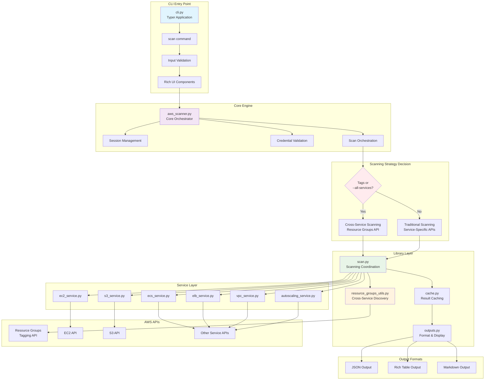
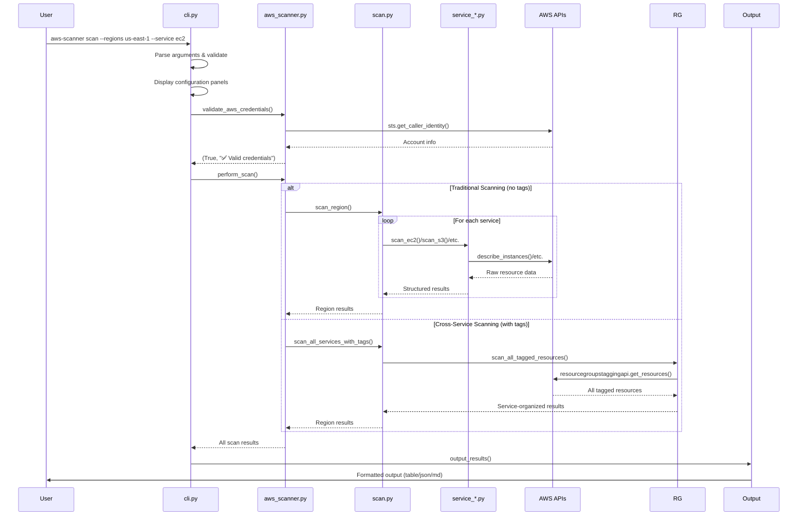
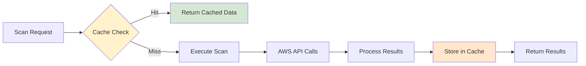
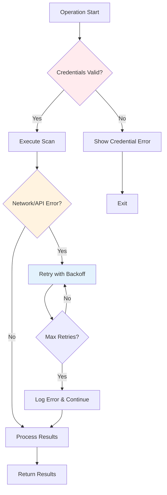

# AWS Scanner Architecture Documentation

## Table of Contents
- [Project Overview](#project-overview)
- [Architecture Overview](#architecture-overview)
- [System Architecture Diagram](#system-architecture-diagram)
- [Module Documentation](#module-documentation)
- [Data Flow Analysis](#data-flow-analysis)
- [API Reference](#api-reference)
- [Configuration & Usage](#configuration--usage)
- [Extending the Scanner](#extending-the-scanner)

## Project Overview

The AWS Multi-Service Scanner is a comprehensive Python tool designed to discover, scan, and inventory AWS resources across multiple services and regions. It provides both traditional service-specific scanning and advanced cross-service scanning using AWS Resource Groups Tagging API.

### Key Features
- **Multi-service scanning**: EC2, S3, ECS, ELB, VPC, Auto Scaling
- **Cross-service discovery**: 100+ AWS services via Resource Groups API
- **Tag-based filtering**: Server-side filtering for optimal performance
- **Multi-region support**: Parallel scanning across regions
- **Multiple output formats**: JSON, Table, Markdown
- **Intelligent caching**: 10-minute TTL with automatic cache management
- **Rich CLI interface**: Progress bars, configuration panels, colored output
- **Graceful shutdown**: Signal handling for clean termination

## Architecture Overview

The AWS Scanner follows a modular, layered architecture designed for maintainability, extensibility, and performance:

```
┌─────────────────────────────────────────────────────────────────┐
│                        CLI Layer (cli.py)                       │
│  ┌──────────────────┐ ┌──────────────────┐ ┌─────────────────┐  │
│  │    Commands      │ │   Validation     │ │   UI/Progress   │  │
│  │   - scan         │ │  - Args parsing  │ │  - Rich panels  │  │
│  │   - dry-run      │ │  - Input checks  │ │  - Progress bars│  │
│  └──────────────────┘ └──────────────────┘ └─────────────────┘  │
└─────────────────────────────────────────────────────────────────┘
                                    │
                                    ▼
┌─────────────────────────────────────────────────────────────────┐
│                   Core Logic Layer (aws_scanner.py)             │
│  ┌──────────────────┐ ┌──────────────────┐ ┌─────────────────┐  │
│  │   Session Mgmt   │ │   Orchestration  │ │   Credential    │  │
│  │  - Connection    │ │  - Scan routing  │ │   Validation    │  │
│  │    pooling       │ │  - Result agg.   │ │  - STS calls    │  │
│  └──────────────────┘ └──────────────────┘ └─────────────────┘  │
└─────────────────────────────────────────────────────────────────┘
                                    │
                        ┌───────────┴───────────┐
                        ▼                       ▼
┌─────────────────────────────────┐ ┌─────────────────────────────────┐
│      Library Layer              │ │      Service Layer              │
│    (aws_scanner_lib/)           │ │       (services/)               │
│ ┌─────────────────────────────┐ │ │ ┌─────────────────────────────┐ │
│ │        scan.py              │ │ │ │      ec2_service.py         │ │
│ │ - Region scanning           │ │ │ │    - EC2 instances          │ │
│ │ - Service coordination      │ │ │ │    - Volumes, AMIs          │ │
│ │ - Cross-service scanning    │ │ │ │    - Security groups        │ │
│ │                             │ │ │ └─────────────────────────────┘ │
│ ├─────────────────────────────┤ │ │ ┌─────────────────────────────┐ │
│ │   resource_groups_utils.py  │ │ │ │      s3_service.py          │ │
│ │ - Resource Groups API       │ │ │ │    - S3 buckets             │ │
│ │ - Cross-service discovery   │ │ │ │    - Bucket policies        │ │
│ │ - ARN parsing               │ │ │ │    - Encryption status      │ │
│ │                             │ │ │ └─────────────────────────────┘ │
│ ├─────────────────────────────┤ │ │ ┌─────────────────────────────┐ │
│ │       cache.py              │ │ │ │    [Other Services...]      │ │
│ │ - Result caching            │ │ │ │  - ECS, ELB, VPC, ASG       │ │
│ │ - TTL management            │ │ │ │  - Consistent interface     │ │
│ │                             │ │ │ └─────────────────────────────┘ │
│ ├─────────────────────────────┤ │ └─────────────────────────────────┘
│ │      outputs.py             │ │
│ │ - Output formatting         │ │
│ │ - Rich table creation       │ │
│ │ - Markdown generation       │ │
│ └─────────────────────────────┘ │
└─────────────────────────────────┘
```

## System Architecture Diagram



## Module Documentation

### 1. CLI Module (`cli.py`)

**Purpose**: Command-line interface and user interaction layer

#### Key Components:

##### Main Application Setup
```python
app = typer.Typer(
    name="aws-scanner",
    help="AWS Multi-Service Scanner with tag filtering",
    add_completion=True,
)
```

##### Core Command: `scan`
```python
@app.command(name="scan")
def scan_command(
    regions: Optional[str] = None,            # Comma-separated regions
    services: List[str] = SUPPORTED_SERVICES, # Services to scan
    profile: Optional[str] = None,            # AWS profile
    tag_key: Optional[str] = None,            # Tag key filter
    tag_value: Optional[str] = None,          # Tag value filter
    output_file: Optional[Path] = None,       # Output file path
    output_format: str = "table",             # Output format
    compare: bool = False,                    # Compare mode
    dry_run: bool = False,                    # Dry run mode
    max_workers: int = 8,                     # Region parallelism
    service_workers: int = 4,                 # Service parallelism
    use_cache: bool = True,                   # Enable caching
    refresh: bool = False,                    # Continuous refresh
    refresh_interval: int = 10,               # Refresh interval
    all_services: bool = False,               # Cross-service mode
) -> None:
```

##### UI Helper Functions:
- `_display_configuration_panel()`: Shows scan configuration
- `_display_regions_panel()`: Shows target regions
- `_handle_dry_run()`: Handles dry-run mode
- `_display_scan_start_message()`: Shows scan initiation
- `_display_scan_completion()`: Shows scan results summary

### 2. Core Engine (`aws_scanner.py`)

**Purpose**: Central orchestration and core business logic

#### Key Functions:

##### Session Management
```python
def get_session(profile_name: Optional[str] = None) -> boto3.Session:
    """Thread-safe AWS session creation with connection pooling"""
    # Implements double-check locking pattern
    # Manages session pool for connection reuse
```

##### Credential Validation
```python
def validate_aws_credentials(
    session: boto3.Session,
    profile_name: Optional[str] = None
) -> tuple[bool, str]:
    """
    Validates AWS credentials using STS get-caller-identity

    Returns:
        tuple: (is_valid: bool, message: str)
    """
```

##### Scan Orchestration
```python
def perform_scan(
    session: boto3.Session,
    region_list: List[str],
    services: List[str],
    tag_key: Optional[str] = None,
    tag_value: Optional[str] = None,
    max_workers: int = 8,
    service_workers: int = 4,
    use_cache: bool = True,
    progress: Optional[Progress] = None,
    all_services: bool = False,
    shutdown_event: Optional[threading.Event] = None,
) -> Dict[str, Dict[str, Any]]:
    """
    Main scan orchestration with intelligent routing:

    Scanning Strategy Decision:
    - If (all_services OR tag_key OR tag_value): Use Resource Groups API
    - Else: Use traditional service-specific scanning
    """
```

##### Display Functions
```python
def display_region_summaries(all_results: Dict[str, Dict[str, Any]]) -> None:
    """Displays region-wise resource summaries with Rich tables"""

def check_and_display_cache_status(...) -> bool:
    """Checks and displays cached results availability"""
```

### 3. Scanning Library (`aws_scanner_lib/`)

#### 3.1 Scan Coordination (`scan.py`)

**Purpose**: Coordinates scanning operations and provides unified interface

##### Core Functions:

```python
def scan_all_services_with_tags(
    session: boto3.Session,
    region: str,
    tag_key: Optional[str] = None,
    tag_value: Optional[str] = None,
    use_cache: bool = True,
) -> Tuple[str, Dict[str, Any], float]:
    """
    Cross-service scanning using Resource Groups API

    Flow:
    1. Check cache for 'all_services' key
    2. Delegate to resource_groups_utils.scan_all_tagged_resources()
    3. Cache results with 'all_services' service name
    4. Return (region, results, duration) tuple
    """

def scan_region(
    session: boto3.Session,
    region: str,
    services: List[str],
    tag_key: Optional[str] = None,
    tag_value: Optional[str] = None,
    service_workers: int = 4,
    use_cache: bool = True,
    progress_callback: Optional[Any] = None,
    shutdown_event: Optional[Any] = None,
) -> Tuple[str, Dict[str, Any], float]:
    """
    Traditional service-specific scanning

    Flow:
    1. Create ThreadPoolExecutor with service_workers
    2. Submit scan_service() tasks for each service
    3. Collect results as futures complete
    4. Handle graceful shutdown via shutdown_event
    """

def scan_service(
    session: boto3.Session,
    region: str,
    service: str,
    tag_key: Optional[str] = None,
    tag_value: Optional[str] = None,
    use_cache: bool = True,
) -> Dict[str, Any]:
    """
    Routes to appropriate service scanner

    Service Routing:
    - ec2 -----------> scan_ec2()
    - s3  -----------> scan_s3()
    - ecs -----------> scan_ecs()
    - elb -----------> scan_elb()
    - vpc -----------> scan_vpc()
    - autoscaling ---> scan_autoscaling()
    """
```

#### 3.2 Cross-Service Discovery (`resource_groups_utils.py`)

**Purpose**: Implements AWS Resource Groups Tagging API for service-agnostic discovery

##### Key Functions:

```python
def scan_all_tagged_resources(
    session: Any,
    region: str,
    tag_key: Optional[str] = None,
    tag_value: Optional[str] = None,
) -> Dict[str, Any]:
    """
    Main function for cross-service resource discovery

    API Usage:
    - Uses ResourceGroupsTaggingAPI.get_resources()
    - NO ResourceTypeFilters (discovers ALL services)
    - Server-side tag filtering for optimal performance

    Returns: Service-organized resource dictionary
    """

def get_all_tagged_resources_across_services(
    session: Any,
    region: str,
    tag_key: Optional[str] = None,
    tag_value: Optional[str] = None,
) -> Dict[str, Any]:
    """
    Core Resource Groups API implementation

    Process:
    1. Build tag filters based on input parameters
    2. Paginate through get_resources() results
    3. Extract service/type from ARNs using _extract_service_and_type_from_arn()
    4. Create standardized resource objects
    """

def _extract_service_and_type_from_arn(arn: str) -> tuple[str, str]:
    """
    Parses AWS ARNs to extract service and resource type

    ARN Format: arn:aws:service:region:account:resource-type/resource-id
    Returns: (service_name, resource_type)
    """

def _extract_resource_id_from_arn(arn: str, resource_type: str) -> Optional[str]:
    """
    Extracts resource ID from ARN with service-specific logic

    Special handling for:
    - S3: arn:aws:s3:::bucket-name
    - ELB: Complex path-based IDs
    - General: Last component after '/' or ':'
    """
```

#### 3.3 Caching System (`cache.py`)

**Purpose**: Intelligent caching with TTL management

##### Cache Configuration:
```python
CACHE_DIR = Path("/tmp/aws_scanner_cache")
CACHE_TTL_MINUTES = 10
```

##### Core Functions:
```python
def get_cache_key(
    region: str,
    service: str,
    tag_key: Optional[str] = None,
    tag_value: Optional[str] = None,
) -> str:
    """
    Generates MD5 cache key from parameters
    Format: "{region}:{service}:{tag_key}:{tag_value}"
    """

def get_cached_result(...) -> Optional[Dict[str, Any]]:
    """
    Retrieves cached result if available and not expired

    Process:
    1. Check if cache file exists
    2. Verify cache age < TTL
    3. Return deserialized data or None
    """

def cache_result(...) -> None:
    """
    Stores scan result in cache

    Uses pickle serialization for complex data structures
    Handles errors gracefully (continues without caching)
    """
```

#### 3.4 Output Formatting (`outputs.py`)

**Purpose**: Multi-format output generation and display

##### Key Constants:
```python
TABLE_MINIMUM_WIDTH = 86  # Ensures readable table formatting
```

##### Core Functions:
```python
def create_aws_resources_table(flattened_resources: List[Dict[str, Any]]) -> Table:
    """
    Creates standardized Rich Table for resource display

    Columns:
    - Region (blue)
    - Resource Type (yellow) - format: service:type
    - Resource ID (green)
    - Resource ARN (white)
    """

def output_results(
    results: Dict[str, Any],
    output_file: Path,
    output_format: str = "json",
    flatten_results: bool = False,
) -> None:
    """
    Main output function supporting multiple formats

    Formats:
    - json: Raw JSON data
    - table: Rich table display
    - md/markdown: Markdown report with summaries
    """

def generate_markdown_summary(
    flattened_resources: List[Dict[str, Any]],
    results: Dict[str, Any]
) -> str:
    """
    Generates comprehensive Markdown report

    Sections:
    - Executive summary with counts
    - Summary by region
    - Summary by service
    - Summary by resource type
    - Detailed resource listings
    """
```

### 4. Service Layer (`services/`)

Each service module follows a consistent interface pattern:

#### Interface Contract:
```python
def scan_[service](
    session: boto3.Session,
    region: str
) -> Dict[str, Any]:
    """
    Service-specific scanning implementation

    Returns:
        Dict with resource type keys and resource lists as values
    """

def process_[service]_output(
    service_name: str,
    region: str,
    raw_results: Dict[str, Any]
) -> List[Dict[str, Any]]:
    """
    Converts raw API results to standardized format

    Returns:
        List of standardized resource dictionaries
    """
```

#### Service-Specific Implementations:

##### EC2 Service (`ec2_service.py`)
```python
# Scanned Resource Types:
- EC2 Instances (describe_instances)
- EBS Volumes (describe_volumes)
- Security Groups (describe_security_groups)
- AMIs (describe_images)
- EBS Snapshots (describe_snapshots)

# Parallel scanning with ThreadPoolExecutor
EC2_MAX_WORKERS = 5

def scan_ec2(session: boto3.Session, region: str) -> Dict[str, Any]:
    """
    Uses parallel workers for different resource types
    Returns dict with keys: instances, volumes, security_groups, images, snapshots
    """
```

##### S3 Service (`s3_service.py`)
```python
# Scanned Resource Types:
- S3 Buckets (list_buckets, get_bucket_*)
- Bucket policies, encryption, versioning, lifecycle

def scan_s3(session: boto3.Session, region: str) -> Dict[str, Any]:
    """
    Global service - filters buckets by region when possible
    Returns dict with key: buckets
    """
```

##### VPC Service (`vpc_service.py`)
```python
# Scanned Resource Types:
- VPCs (describe_vpcs)
- Subnets (describe_subnets)
- Internet Gateways (describe_internet_gateways)
- Route Tables (describe_route_tables)
- NACLs (describe_network_acls)
```

## Data Flow Analysis

### 1. Command Execution Flow



### 2. Caching Flow



### 3. Error Handling Flow



## API Reference

### 1. CLI API

#### Command: `aws-scanner scan`

**Syntax:**
```bash
aws-scanner scan [OPTIONS]
```

**Options:**

| Option | Short | Type | Default | Description |
|--------|-------|------|---------|-------------|
| `--regions` | `-r` | `str` | EU+US regions | Comma-separated AWS regions |
| `--service` | `-s` | `List[str]` | All supported | AWS services to scan |
| `--profile` | `-p` | `str` | `None` | AWS profile to use |
| `--tag-key` | | `str` | `None` | Filter by tag key |
| `--tag-value` | | `str` | `None` | Filter by tag value |
| `--output` | `-o` | `Path` | Auto-generated | Output file path |
| `--format` | `-f` | `str` | `table` | Output format (json\|table\|md) |
| `--compare` | `-c` | `bool` | `False` | Compare with existing results |
| `--dry-run` | | `bool` | `False` | Show scan plan without execution |
| `--max-workers` | `-w` | `int` | `8` | Region parallelism (1-20) |
| `--service-workers` | | `int` | `4` | Service parallelism (1-10) |
| `--cache/--no-cache` | | `bool` | `True` | Enable/disable caching |
| `--refresh` | | `bool` | `False` | Continuous refresh mode |
| `--refresh-interval` | `-i` | `int` | `10` | Refresh interval (5-300s) |
| `--all-services` | | `bool` | `False` | Use Resource Groups API |

**Examples:**
```bash
# Basic EC2 scan in US East
aws-scanner scan --regions us-east-1 --service ec2

# Cross-service scan with tag filtering
aws-scanner scan --tag-key Environment --tag-value Production --all-services

# Multi-region VPC scan with JSON output
aws-scanner scan --regions us-east-1,eu-west-1 --service vpc --format json

# Dry run to see what would be scanned
aws-scanner scan --regions us-west-2 --service ec2,s3 --dry-run

# High-performance scan with more workers
aws-scanner scan --max-workers 12 --service-workers 8 --no-cache
```

### 2. Core Functions API

#### Session Management

```python
def get_session(profile_name: Optional[str] = None) -> boto3.Session:
    """
    Get AWS session with connection pooling

    Args:
        profile_name: AWS profile name (optional)

    Returns:
        boto3.Session: Configured AWS session

    Raises:
        RuntimeError: If profile not found or session creation fails
    """
```

#### Credential Validation

```python
def validate_aws_credentials(
    session: boto3.Session,
    profile_name: Optional[str] = None
) -> tuple[bool, str]:
    """
    Validate AWS credentials using STS

    Args:
        session: AWS session to validate
        profile_name: Profile name for error messages (optional)

    Returns:
        tuple: (is_valid, message)
            - is_valid (bool): True if credentials are valid
            - message (str): Success message with account info or error description

    Example:
        >>> session = boto3.Session()
        >>> valid, msg = validate_aws_credentials(session)
        >>> print(f"Valid: {valid}, Message: {msg}")
        Valid: True, Message: ✅ AWS credentials valid (Account: 123456789012, User: user-name)
    """
```

#### Scan Orchestration

```python
def perform_scan(
    session: boto3.Session,
    region_list: List[str],
    services: List[str],
    tag_key: Optional[str] = None,
    tag_value: Optional[str] = None,
    max_workers: int = 8,
    service_workers: int = 4,
    use_cache: bool = True,
    progress: Optional[Progress] = None,
    all_services: bool = False,
    shutdown_event: Optional[threading.Event] = None,
) -> Dict[str, Dict[str, Any]]:
    """
    Main scan orchestration function

    Args:
        session: Configured AWS session
        region_list: List of AWS regions to scan
        services: List of AWS services to scan
        tag_key: Tag key for filtering (triggers Resource Groups API)
        tag_value: Tag value for filtering
        max_workers: Maximum parallel region workers
        service_workers: Maximum parallel service workers per region
        use_cache: Enable result caching
        progress: Rich Progress instance for UI updates (optional)
        all_services: Force Resource Groups API usage
        shutdown_event: Event for graceful shutdown (optional)

    Returns:
        Dict[str, Dict[str, Any]]: Scan results organized by region

    Scanning Strategy:
        - If (all_services OR tag_key OR tag_value): Use Resource Groups API
        - Else: Use traditional service-specific scanning

    Example:
        >>> session = boto3.Session()
        >>> results = perform_scan(
        ...     session=session,
        ...     region_list=["us-east-1", "eu-west-1"],
        ...     services=["ec2", "s3"],
        ...     max_workers=4
        ... )
        >>> print(f"Found resources in {len(results)} regions")
    """
```

### 3. Scanning Library API

#### Region Scanning

```python
def scan_region(
    session: boto3.Session,
    region: str,
    services: List[str],
    tag_key: Optional[str] = None,
    tag_value: Optional[str] = None,
    service_workers: int = 4,
    use_cache: bool = True,
    progress_callback: Optional[Callable[[int, int, str, str], None]] = None,
    shutdown_event: Optional[threading.Event] = None,
) -> Tuple[str, Dict[str, Any], float]:
    """
    Scan all services in a single region

    Args:
        session: AWS session
        region: AWS region name
        services: List of services to scan
        tag_key: Tag key for filtering (not used in traditional scanning)
        tag_value: Tag value for filtering (not used in traditional scanning)
        service_workers: Parallel service workers
        use_cache: Enable caching
        progress_callback: Function to report scan progress (optional)
        shutdown_event: Event for graceful shutdown (optional)

    Returns:
        Tuple[str, Dict[str, Any], float]: (region, results, scan_duration)

    Progress Callback Signature:
        callback(completed: int, total: int, service: str, region: str) -> None
    """
```

#### Cross-Service Scanning

```python
def scan_all_services_with_tags(
    session: boto3.Session,
    region: str,
    tag_key: Optional[str] = None,
    tag_value: Optional[str] = None,
    use_cache: bool = True,
) -> Tuple[str, Dict[str, Any], float]:
    """
    Scan ALL AWS services using Resource Groups API

    Args:
        session: AWS session
        region: AWS region name
        tag_key: Tag key to filter by (optional)
        tag_value: Tag value to filter by (optional)
        use_cache: Enable caching

    Returns:
        Tuple[str, Dict[str, Any], float]: (region, results, scan_duration)

    Note:
        - Discovers 100+ AWS services automatically
        - Server-side filtering for optimal performance
        - Returns same format as scan_region() for compatibility
    """
```

#### Service-Specific Scanning

```python
def scan_service(
    session: boto3.Session,
    region: str,
    service: str,
    tag_key: Optional[str] = None,
    tag_value: Optional[str] = None,
    use_cache: bool = True,
) -> Dict[str, Any]:
    """
    Scan a specific AWS service in a region

    Args:
        session: AWS session
        region: AWS region name
        service: Service name (ec2, s3, ecs, elb, vpc, autoscaling)
        tag_key: Tag key (unused in current implementation)
        tag_value: Tag value (unused in current implementation)
        use_cache: Enable caching

    Returns:
        Dict[str, Any]: Service-specific results

    Service Routing:
        - ec2 -> scan_ec2()
        - s3 -> scan_s3()
        - ecs -> scan_ecs()
        - elb -> scan_elb()
        - vpc -> scan_vpc()
        - autoscaling -> scan_autoscaling()
    """
```

### 4. Caching API

```python
def get_cached_result(
    region: str,
    service: str,
    tag_key: Optional[str] = None,
    tag_value: Optional[str] = None,
) -> Optional[Dict[str, Any]]:
    """
    Retrieve cached scan result

    Args:
        region: AWS region name
        service: Service name or 'all_services'
        tag_key: Tag key used in original scan (optional)
        tag_value: Tag value used in original scan (optional)

    Returns:
        Optional[Dict[str, Any]]: Cached result or None if not found/expired

    Cache Key Format:
        MD5("{region}:{service}:{tag_key}:{tag_value}")
    """

def cache_result(
    region: str,
    service: str,
    result: Any,
    tag_key: Optional[str] = None,
    tag_value: Optional[str] = None,
) -> None:
    """
    Store scan result in cache

    Args:
        region: AWS region name
        service: Service name or 'all_services'
        result: Scan result to cache
        tag_key: Tag key used in scan (optional)
        tag_value: Tag value used in scan (optional)

    Cache Details:
        - TTL: 10 minutes
        - Location: /tmp/aws_scanner_cache/
        - Format: Pickle serialization
        - Error handling: Silent failure (continues without caching)
    """
```

### 5. Output API

```python
def output_results(
    results: Dict[str, Any],
    output_file: Path,
    output_format: str = "json",
    flatten_results: bool = False,
) -> None:
    """
    Output scan results in specified format

    Args:
        results: Scan results dictionary
        output_file: Path for output file
        output_format: Output format ('json', 'table', 'md', 'markdown')
        flatten_results: Whether to flatten nested results

    Format Details:
        - json: Raw JSON data with proper indentation
        - table: Rich table display with colored columns
        - md/markdown: Comprehensive report with summaries and details

    File Handling:
        - Automatically creates output directories
        - Overwrites existing files
        - Handles encoding properly (UTF-8)
    """

def create_aws_resources_table(flattened_resources: List[Dict[str, Any]]) -> Table:
    """
    Create standardized Rich Table for resource display

    Args:
        flattened_resources: List of resource dictionaries

    Returns:
        Table: Rich Table ready for console display

    Required Resource Dictionary Format:
        {
            "region": str,
            "resource_type": str,  # Format: "service:type"
            "resource_id": str,
            "resource_arn": str,
            "resource_name": str  # Optional
        }

    Table Columns:
        - Region (blue styling)
        - Resource Type (yellow styling)
        - Resource ID (green styling)
        - Resource ARN (white styling)
    """
```

### 6. Service Interface Contract

Each service module must implement this interface:

```python
def scan_{service}(
    session: boto3.Session,
    region: str
) -> Dict[str, Any]:
    """
    Service-specific scanning implementation

    Args:
        session: Configured AWS session
        region: AWS region to scan

    Returns:
        Dict[str, Any]: Resource data organized by resource type

    Example Return Format:
        {
            "instances": [...],      # List of EC2 instances
            "volumes": [...],        # List of EBS volumes
            "security_groups": [...] # List of security groups
        }

    Error Handling:
        - Must handle ClientError exceptions gracefully
        - Should use retry_with_backoff for transient errors
        - Must return empty dict on unrecoverable errors
    """

def process_{service}_output(
    service_name: str,
    region: str,
    raw_results: Dict[str, Any]
) -> List[Dict[str, Any]]:
    """
    Convert raw API results to standardized format

    Args:
        service_name: Name of the AWS service
        region: AWS region name
        raw_results: Raw results from scan_{service}()

    Returns:
        List[Dict[str, Any]]: Standardized resource dictionaries

    Required Output Format:
        [
            {
                "resource_id": str,
                "resource_name": str,
                "resource_type": str,    # Format: "service:type"
                "resource_arn": str,
                "region": str,
                "service": str,
                "tags": Dict[str, str],  # Optional
                # ... service-specific fields
            }
        ]
    """
```

## Configuration & Usage

### 1. Installation & Setup

```bash
# Clone repository
git clone https://github.com/ishuar/aws-resource-scanner.git
cd aws-resource-scanner

# Install with Poetry
poetry install

# Or install with pip
pip install -e .

# Verify installation
aws-scanner --help
```

### 2. AWS Configuration

#### Method 1: AWS Profile
```bash
# Configure AWS CLI profile
aws configure --profile production

# Use with scanner
aws-scanner scan --profile production --regions us-east-1
```

#### Method 2: Environment Variables
```bash
# Set environment variables
export AWS_PROFILE=production
export AWS_REGION=us-east-1

# Use with scanner
aws-scanner scan
```

#### Method 3: IAM Roles (EC2/Lambda)
```bash
# No additional configuration needed
aws-scanner scan --regions us-east-1
```

### 3. Required IAM Permissions

#### Minimal Permissions (Traditional Scanning)
```json
{
    "Version": "2012-10-17",
    "Statement": [
        {
            "Effect": "Allow",
            "Action": [
                "sts:GetCallerIdentity",
                "ec2:Describe*",
                "s3:List*",
                "s3:Get*",
                "ecs:Describe*",
                "ecs:List*",
                "elasticloadbalancing:Describe*",
                "autoscaling:Describe*"
            ],
            "Resource": "*"
        }
    ]
}
```

#### Enhanced Permissions (Cross-Service Scanning)
```json
{
    "Version": "2012-10-17",
    "Statement": [
        {
            "Effect": "Allow",
            "Action": [
                "sts:GetCallerIdentity",
                "resource-groups:GetResources",
                "tag:GetResources"
            ],
            "Resource": "*"
        }
    ]
}
```

### 4. Usage Patterns

#### Development Workflow
```bash
# Quick development scan
aws-scanner scan --regions us-east-1 --service ec2 --dry-run

# Development with caching disabled
aws-scanner scan --no-cache --regions us-east-1 --service ec2,s3

# Continuous development monitoring
aws-scanner scan --refresh --refresh-interval 30 --regions us-east-1
```

#### Production Workflow
```bash
# Complete inventory scan
aws-scanner scan --all-services --tag-key Environment --tag-value Production

# Multi-region compliance scan
aws-scanner scan --regions us-east-1,us-west-2,eu-west-1 --format json --output compliance-report.json

# Performance-optimized scan
aws-scanner scan --max-workers 12 --service-workers 8 --regions us-east-1,eu-west-1
```

#### Monitoring Workflow
```bash
# Resource change detection
aws-scanner scan --compare --output daily-scan.json

# Tagged resource monitoring
aws-scanner scan --tag-key CostCenter --format md --output cost-center-report.md

# Infrastructure drift detection
aws-scanner scan --refresh --refresh-interval 300 --format table
```

## Extending the Scanner

### 1. Adding New AWS Services

#### Step 1: Create Service Module
Create `services/new_service.py`:

```python
"""
New Service Scanner
------------------

Handles scanning of [Service Name] resources.
"""

from typing import Any, Dict, List
from botocore.exceptions import ClientError
from rich.console import Console

console = Console()

def scan_new_service(session: boto3.Session, region: str) -> Dict[str, Any]:
    """
    Scan [Service Name] resources in a region

    Args:
        session: AWS session
        region: AWS region name

    Returns:
        Dict with resource type keys and resource lists as values
    """
    try:
        client = session.client('new-service', region_name=region)
        results = {}

        # Implement service-specific scanning logic
        # Example:
        paginator = client.get_paginator('describe_resources')
        resources = []
        for page in paginator.paginate():
            resources.extend(page['Resources'])

        results['resources'] = resources
        return results

    except ClientError as e:
        console.print(f"[red]Error scanning new-service in {region}: {e}[/red]")
        return {}

def process_new_service_output(
    service_name: str,
    region: str,
    raw_results: Dict[str, Any]
) -> List[Dict[str, Any]]:
    """
    Convert raw results to standardized format

    Args:
        service_name: Service name ('new-service')
        region: AWS region name
        raw_results: Raw results from scan_new_service()

    Returns:
        List of standardized resource dictionaries
    """
    standardized_resources = []

    for resource in raw_results.get('resources', []):
        standardized_resource = {
            'resource_id': resource.get('ResourceId'),
            'resource_name': resource.get('ResourceName', resource.get('ResourceId')),
            'resource_type': f"{service_name}:resource",
            'resource_arn': resource.get('ResourceArn'),
            'region': region,
            'service': service_name,
            'tags': {tag['Key']: tag['Value'] for tag in resource.get('Tags', [])},
            # Add service-specific fields
            'custom_field': resource.get('CustomField')
        }
        standardized_resources.append(standardized_resource)

    return standardized_resources
```

#### Step 2: Update Service Registry
Update `services/__init__.py`:

```python
from .new_service import scan_new_service, process_new_service_output

__all__ = [
    # ... existing services
    "scan_new_service",
    "process_new_service_output",
]
```

#### Step 3: Update Core Scanner
Update `aws_scanner.py` SUPPORTED_SERVICES:

```python
SUPPORTED_SERVICES = [
    "ec2", "s3", "ecs", "elb", "vpc", "autoscaling",
    "new-service"  # Add new service
]
```

#### Step 4: Update Scan Routing
Update `aws_scanner_lib/scan.py` scan_service():

```python
def scan_service(...):
    # ... existing imports
    from services import scan_new_service

    # ... existing routing
    elif service == "new-service":
        return scan_new_service(session, region)
```

### 2. Adding New Output Formats

#### Step 1: Update Output Function
Update `aws_scanner_lib/outputs.py`:

```python
def output_results(
    results: Dict[str, Any],
    output_file: Path,
    output_format: str = "json",
    flatten_results: bool = False,
) -> None:
    # ... existing formats
    elif output_format in ["xml"]:
        _output_xml_format(flattened_resources, output_file)

def _output_xml_format(flattened_resources: List[Dict[str, Any]], output_file: Path) -> None:
    """Output results in XML format"""
    import xml.etree.ElementTree as ET

    root = ET.Element("aws_resources")

    for resource in flattened_resources:
        resource_elem = ET.SubElement(root, "resource")
        for key, value in resource.items():
            elem = ET.SubElement(resource_elem, key)
            elem.text = str(value)

    tree = ET.ElementTree(root)
    tree.write(output_file, encoding='utf-8', xml_declaration=True)
    console.print(f"[green]✅ Results saved to {output_file} (XML format)[/green]")
```

#### Step 2: Update CLI Help
Update `cli.py` option help text:

```python
output_format: str = typer.Option(
    "table", "--format", "-f",
    help="Output format (json|table|md|markdown|xml)"
),
```

### 3. Adding Custom Filters

#### Step 1: Extend CLI Options
Update `cli.py` scan_command:

```python
@app.command(name="scan")
def scan_command(
    # ... existing options
    resource_state: Optional[str] = typer.Option(
        None, "--state", help="Filter by resource state (running|stopped|available|etc.)"
    ),
    min_resources: Optional[int] = typer.Option(
        None, "--min-resources", help="Minimum resource count threshold"
    ),
):
```

#### Step 2: Implement Filter Logic
Update service scanners to support filters:

```python
def scan_ec2(
    session: boto3.Session,
    region: str,
    resource_state: Optional[str] = None
) -> Dict[str, Any]:

    filters = []
    if resource_state:
        filters.append({'Name': 'state-name', 'Values': [resource_state]})

    # Use filters in API calls
    ec2_client = session.client('ec2', region_name=region)
    response = ec2_client.describe_instances(Filters=filters)
```

### 4. Performance Optimization

#### Async/Concurrent Enhancements
```python
import asyncio
import aioboto3

async def async_scan_service(session, region, service):
    """Async version of service scanning"""
    async with aioboto3.Session().client(service, region_name=region) as client:
        # Implement async API calls
        pass

# Usage in scan orchestration
async def async_perform_scan(...):
    tasks = []
    for region in region_list:
        for service in services:
            task = asyncio.create_task(async_scan_service(session, region, service))
            tasks.append(task)

    results = await asyncio.gather(*tasks)
```

#### Memory Optimization
```python
def stream_large_results(results_generator):
    """Stream results for large scans to reduce memory usage"""
    for chunk in results_generator:
        yield process_chunk(chunk)
        # Allow garbage collection between chunks
        gc.collect()
```

## Troubleshooting Guide

### Common Issues

#### 1. Credential Problems
```bash
# Check AWS configuration
aws sts get-caller-identity

# Verify profile
aws configure list --profile production

# Test with different profile
aws-scanner scan --profile default --regions us-east-1
```

#### 2. Permission Issues
```bash
# Test specific service permissions
aws ec2 describe-instances --region us-east-1
aws s3 ls

# Test Resource Groups API
aws resourcegroupstaggingapi get-resources --region us-east-1
```

#### 3. Performance Issues
```bash
# Reduce parallelism
aws-scanner scan --max-workers 2 --service-workers 1

# Disable caching
aws-scanner scan --no-cache

# Scan fewer regions/services
aws-scanner scan --regions us-east-1 --service ec2
```

#### 4. Output Issues
```bash
# Check output directory permissions
ls -la $(dirname output-file.json)

# Verify file format
aws-scanner scan --format json --output /tmp/test.json
```

### Debug Mode
```bash
# Enable verbose logging (if implemented)
export AWS_SCANNER_DEBUG=1
aws-scanner scan --regions us-east-1

# Python debugging
python -m pdb -c continue $(which aws-scanner) scan --regions us-east-1
```

This comprehensive documentation provides a complete reference for understanding, using, and extending the AWS Scanner tool. The modular architecture, clear API contracts, and extensive examples make it easy to maintain and enhance the system.
